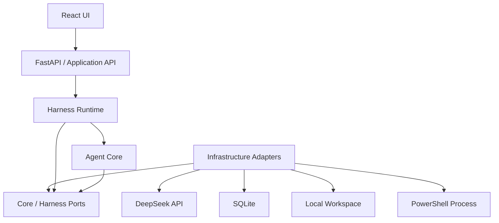
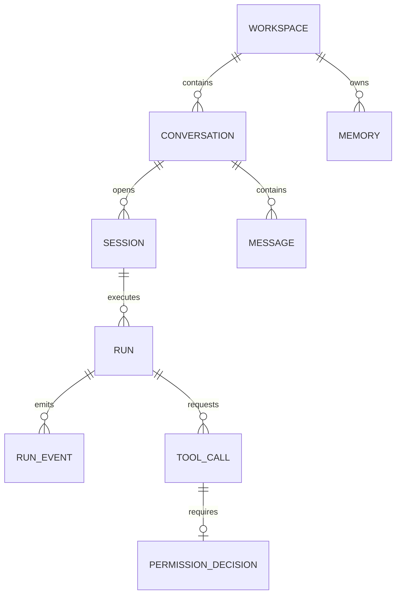

# Mini-Agent Architecture（架构）

## 1. Architecture Goals（架构目标）

Mini-Agent 是一个用于理解 Agent 产品完整运行机制的教学型 Agent Harness。架构优先保证边界清楚、执行过程可观察，并保留逐步演进能力，而不是追求企业级扩展性。

架构目标：

1. 保持 Agent Core 足够小，核心逻辑可以独立理解和测试。
2. 清晰分离 UI、Application API、Harness Runtime、Agent Core 与 Infrastructure。
3. Agent Core 不直接承担权限、安全、进程管理、Web 或数据库职责。
4. 模块通过明确的数据类型和 Port 接口通信，具体实现通过依赖注入接入。
5. 从第一条动态链路开始统一使用 Run 与 Event 模型。
6. 优先支持本地、单用户、单 Agent、全局单 Run 场景。
7. 每个 Roadmap 增量都能在不重写核心边界的前提下加入能力。

## 2. Product and System Boundaries（产品与系统边界）

Mini-Agent 是一个模块化单体，由一个 React Web UI 和一个本地 Python 服务组成。

### 2.1 v1 Baseline

| Area | Decision |
|---|---|
| Frontend | React + Vite + TypeScript |
| Backend | Python + FastAPI + Pydantic |
| Persistence | SQLite，使用标准库 `sqlite3` 和 Repository |
| Communication | REST 命令接口 + SSE Run 事件流 |
| LLM | 仅实现 `DeepSeekProvider`，模型与端点通过配置指定 |
| Runtime | 本地 Python 进程，全局最多一个活动 Run |
| Execution | Windows 优先，本地文件、Apply Patch、受控 PowerShell |
| Workspace | 用户选择的本地项目目录，只支持 Local Workspace |
| Memory | Workspace 级显式长期记忆 |

### 2.2 Explicitly Out of Scope

- Multi-Agent Orchestration。
- 多 Run 并发和后台 Run 队列。
- Git Worktree 执行环境。
- Container Sandbox 或虚拟机隔离。
- 跨平台 Shell 行为一致性。
- 分层加载 Workspace 内的 `AGENTS.md`。
- 自动提取长期记忆。
- 多 LLM Provider 实现。
- OAuth、复杂 RBAC 和远程多用户部署。

受控本地执行只提供路径、参数、权限和进程安全边界，不宣称等价于安全沙箱。

Codex 的 Local 模式以用户选择的项目目录为环境根目录，Worktree 是额外的并行隔离模式；Mini-Agent v1 只实现 Local Workspace：

- [Codex Local environments](https://learn.chatgpt.com/docs/environments/local-environment)
- [Codex Worktrees](https://learn.chatgpt.com/docs/environments/git-worktrees)

## 3. System Overview（系统总览）



UI、Agent Core 和 Harness 不是三个独立产品，而是 Mini-Agent 内部不同职责的逻辑层。开发与部署可以保持为一个前端应用和一个后端进程。

## 4. Layer Responsibilities（分层职责）

### 4.1 UI Layer

负责：

- Workspace、Conversation 与 Session 交互。
- Message、Reasoning、Tool Call 和 Tool Result 渲染。
- SSE Event 消费和前端 Run 状态投影。
- Permission 审批、拒绝和 Run 取消操作。
- 网络错误、重连和最终持久状态恢复。

UI 不自行推断后端真实 Run 状态，也不直接访问 DeepSeek、SQLite 或本地文件系统。

### 4.2 Application/API Layer

负责：

- 暴露 Workspace、Conversation、Session、Run、Permission 和 Memory 用例。
- 将 HTTP 输入转换为 Application Command。
- 将领域错误映射为稳定的 HTTP 错误响应。
- 建立 SSE 连接并转发 Runtime Event。

API 只协调用例，不包含 Agent Loop、工具执行或持久化细节。

### 4.3 Harness Runtime

负责：

- Session 与 Run 生命周期。
- 全局活动 Run 锁。
- Event sequence、内存缓冲、持久化和分发。
- Agent Core 与 Infrastructure Adapter 的组装和调用。
- Tool input validation、Safety、Permission、Approval 和 Execution。
- PowerShell 超时、输出限制和取消。
- 启动恢复及未完成状态修复。

### 4.4 Agent Core

Agent Core 只包含：

- Context Assembly。
- Agent Loop。
- LLM 与 Tool 的领域数据类型。
- Tool Definition / Tool Request 协议。
- Memory Tool 协议。
- Loop termination、最大步数与错误规则。

Agent Core 只能通过 Port 请求外部能力，不得直接依赖 FastAPI、SQLite、DeepSeek SDK、React、本地文件系统或操作系统进程。

### 4.5 Infrastructure

负责实现外部能力 Adapter：

- `DeepSeekProvider`。
- SQLite Repository 和 Event Store。
- Local Workspace 文件访问。
- 文本搜索和 Apply Patch。
- PowerShell Process Executor。
- Clock、ID 和配置等基础服务。

## 5. Ports and Public Contracts（端口与公共契约）

Agent Core 与 Harness 使用稳定 Port 隔离具体实现。v1 至少包含以下接口概念：

| Port | Responsibility |
|---|---|
| `LLMProvider` | 接收统一 LLM Request，流式返回 reasoning、text 和 tool-call delta |
| `ToolInvoker` | 接收 Tool Request，返回 Tool Result；执行策略由 Harness 控制 |
| `ConversationRepository` | 读取和保存 Conversation 与 Message |
| `RuntimeRepository` | 保存 Session、Run、ToolCall 和 PermissionDecision |
| `WorkspaceRepository` | 保存并解析 Workspace 元数据 |
| `MemoryRepository` | 保存、搜索和删除 Workspace Memory |
| `EventStore` | 保存关键领域事件并按 Run/sequence 查询 |
| `EventSink` | 发布当前 Run 的实时 Event |

具体 Python Protocol、Pydantic Schema、REST 路由和数据库列由对应 Feature SPEC 确定，但不得改变本文件中的职责归属和依赖方向。

DeepSeek 的模型 ID、API Key、Base URL 和 Thinking 模式必须通过配置提供，禁止硬编码。`DeepSeekProvider` 负责把 DeepSeek Chat Completion 格式转换成 Core 的统一类型。

- [DeepSeek Chat Completion](https://api-docs.deepseek.com/api/create-chat-completion)
- [DeepSeek Tool Calls](https://api-docs.deepseek.com/guides/tool_calls)

## 6. Domain Model（领域模型）



### 6.1 Entities

- **Workspace**：用户选择的本地项目根目录和项目元数据。
- **Conversation**：属于一个 Workspace 的持久对话。
- **Session**：一次打开或恢复 Conversation 形成的 Runtime 上下文；同一 Conversation 可以有多个历史 Session。
- **Run**：一条用户消息触发的一次 Agent 执行，属于当前 Session。
- **Message**：属于 Conversation 的用户、助手或工具消息；助手消息可保存完整 reasoning 内容。
- **Memory**：属于 Workspace 的显式长期记忆，可跨 Conversation 使用。
- **ToolCall**：属于 Run 的工具请求、审批状态、执行状态和结果。
- **PermissionDecision**：针对单个 ToolCall 的 ALLOW、DENY 或人工审批结果。
- **RunEvent**：属于 Run 的关键领域事件。

### 6.2 Ownership Invariants

- Conversation 创建后不能移动到另一个 Workspace。
- Session 必须继承 Conversation 的 Workspace。
- Run 必须属于一个活动 Session。
- Message 持久化在 Conversation 下，不因 Session 关闭而删除。
- Memory 只能被同一 Workspace 的 Conversation 使用。
- PermissionDecision 只对关联的单个 ToolCall 有效。

## 7. Runtime State Machines（运行时状态机）

### 7.1 Session

```text
CREATED → ACTIVE → CLOSED
                 → STALE
```

- 打开或恢复 Conversation 时创建 Session。
- 正常离开时 Session 可以关闭。
- 后端重启后，未正常关闭的活动 Session 标记为 `STALE`。

### 7.2 Run

```text
CREATED
  → RUNNING
      ├→ WAITING_APPROVAL → RUNNING
      └→ COMPLETED | FAILED | CANCELLED
```

- 任意时刻全局最多一个 `RUNNING` 或 `WAITING_APPROVAL` Run。
- 忙碌时创建第二个 Run 返回 Conflict，不进入队列。
- Run 在执行或等待审批时均可取消。
- 后端重启后，未终止 Run 标记为 `FAILED`，错误原因记录为 interrupted by restart。
- Run 进入终态后不得再产生新事件或执行新工具。

### 7.3 ToolCall

```text
REQUESTED
  ├→ RUNNING → COMPLETED | FAILED | CANCELLED
  ├→ WAITING_APPROVAL → RUNNING | DENIED | CANCELLED
  └→ DENIED
```

只读工具可以从 `REQUESTED` 直接进入 `RUNNING`。需要 ASK 的工具必须先进入 `WAITING_APPROVAL`。

## 8. Event and Streaming Architecture（事件与流式架构）

### 8.1 Event Envelope

所有实时事件使用统一信封：

```text
event_id
run_id
sequence
type
timestamp
payload
```

- `sequence` 在单个 Run 内严格递增。
- UI 按 `run_id + sequence` 去重和排序。
- Event payload 由 `type` 对应的 Pydantic Schema 定义。

### 8.2 Minimum Event Types

- `run.created`
- `run.started`
- `reasoning.delta`
- `reasoning.completed`
- `message.delta`
- `message.completed`
- `tool.requested`
- `permission.requested`
- `permission.resolved`
- `tool.started`
- `tool.completed`
- `tool.failed`
- `tool.denied`
- `tool.cancelled`
- `run.completed`
- `run.failed`
- `run.cancelled`

### 8.3 REST + SSE Protocol

1. UI 通过 REST 创建 Run，API 返回 `run_id`。
2. Runtime 立即为 Run 建立带 sequence 的内存 Event Buffer。
3. UI 使用 SSE 和 `after_sequence` 订阅、续传当前 Run 事件。
4. 当前 Run 的 reasoning/text delta 保留在内存缓冲中，用于进程存活期间重连。
5. 完整 reasoning、完整 Message、ToolCall、PermissionDecision 和终止事件写入 SQLite。
6. 不逐 token 持久化 `reasoning.delta` 和 `message.delta`。
7. 进程重启后，以数据库最终状态为准；未完成的 delta 不保证恢复。

## 9. Tool, Permission and Safety（工具、权限与安全）

### 9.1 v1 Tool Set

- `list_files`
- `read_file`
- `search_text`
- `apply_patch`
- `shell`
- `memory_save`
- `memory_search`
- `memory_delete`

### 9.2 Execution Pipeline

```text
Tool Request
→ Schema Validation
→ Input Normalization
→ Path / Command Safety
→ Permission Policy
→ Human Approval when ASK
→ Executor
→ Tool Result
```

Safety 必须在 Permission 之前处理归一化输入和不可允许的请求。用户不能通过审批绕过 Workspace 边界等硬性 DENY 规则。

### 9.3 Default Policy

| Operation | Default |
|---|---|
| Workspace 内列目录、读文件、文本搜索 | `ALLOW` |
| Memory 保存、搜索和删除 | `ALLOW` |
| Apply Patch | `ASK` for each ToolCall |
| PowerShell | `ASK` for each ToolCall |
| 文件工具访问 Workspace 外路径 | `DENY` |
| 无效参数、无法规范化路径 | `DENY` |

### 9.4 Execution Invariants

- 所有相对路径均相对于 Workspace Root 解析。
- 路径通过规范化和实际边界检查后才能访问。
- Apply Patch 必须使用结构化 Patch，不能退化为未审查的整文件覆盖。
- PowerShell 固定以 Workspace Root 为工作目录。
- PowerShell 必须有超时、最大输出限制和 Windows 进程树取消机制。
- PowerShell 命令始终完整展示并逐次 ASK；Command Safety 拒绝显而易见的危险输入，但不能保证命令被限制在 Workspace 内。
- 用户批准 PowerShell 只代表同意该次本地执行，不等价于 Sandbox 隔离。
- Approval 只对当前 ToolCall 有效，不生成 Session 或 Workspace 持久授权。
- Tool Result 必须返回结构化成功、失败或取消状态，不能只返回非结构化异常。

## 10. Memory and Context Assembly（记忆与上下文组装）

Context Assembly 使用以下顺序：

1. 内置 System Prompt。
2. Workspace、Session 和 Run Runtime Context。
3. Conversation History。
4. 当前可用 Tool Definitions。
5. Agent 通过 Memory Tool 显式查询到的 Workspace Memory。
6. 当前 Agent Loop 已产生的 Tool Result。

规则：

- v1 不加载 Workspace 中的 `AGENTS.md`。
- Conversation History 是消息记录，不等同于长期 Memory。
- Memory 属于 Workspace，可跨 Conversation 使用。
- Memory 只能通过显式 Tool 保存、搜索和删除，不进行自动提取。
- Context Assembly 必须具有可测试的顺序、预算和截断策略。
- DeepSeek reasoning 实时展示，并在完成后保存完整内容；不逐 token 落库。

## 11. Persistence Architecture（持久化架构）

SQLite 至少包含以下逻辑表：

```text
schema_versions
workspaces
conversations
sessions
messages
runs
run_events
tool_calls
permission_decisions
memories
```

持久化规则：

- 使用 Repository 隔离 SQL 和领域逻辑。
- Migration 按版本顺序执行，禁止依赖手工修改本地数据库。
- Run、ToolCall、PermissionDecision 和关键 RunEvent 的状态更新必须保持事务一致性。
- Token delta 只属于实时传输层，不写入 `run_events`。
- 启动恢复在接受新 Run 之前完成。

## 12. Dependency and Evolution Rules（依赖与演进规则）

### 12.1 Dependency Rules

- UI 只能通过公开 API 和 Event Schema 依赖后端。
- API 依赖 Application/Harness 用例，不依赖 Infrastructure 细节。
- Harness 可以编排 Core Port 和 Infrastructure Adapter。
- Core 只依赖领域类型和 Port。
- Infrastructure 实现 Port，但不能把 SDK、SQL 或 OS 类型泄漏到 Core。
- 新 Feature 不得绕过 Runtime 直接执行工具或写入数据库。

### 12.2 Change Rules

- Feature SPEC 必须声明是否影响本架构中的实体、Port、状态机、事件或安全不变量。
- 如果需要改变这些公共决策，必须先更新本文件或增加 ADR，再生成实现 Plan。
- Plan 和 Task 不能隐式改变上游架构。
- Roadmap 必须按照本文件中的依赖顺序引入能力，尤其是 Runtime 先于真实 Agent Tool、安全边界先于危险执行能力。

## 13. Verification Baseline（验证基线）

- Python：pytest。
- React：Vitest + React Testing Library。
- End-to-End：Playwright。
- DeepSeek：自动测试使用 Fake Provider；真实 API 仅作为可选 Smoke Test。
- 路径、安全、状态转换、取消、恢复和事件顺序必须具有自动测试。
- 每个 Milestone 同时具备自动验证和人工演示路径。
