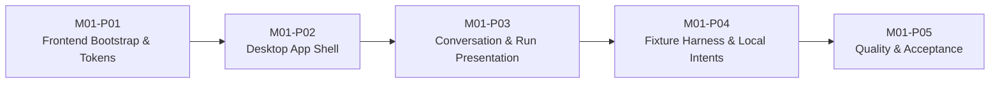

# M01 — UI Foundation Sequential PLANs

> 本文把 [SPEC.md](./SPEC.md) 拆成五个顺序、可集成、可验证的 Plan。后续完善 [TASK.md](./TASK.md) 时，应一次只展开当前 Plan，并沿用本文定义的依赖、写入范围、输出契约和 Requirement ID。

## 1. Plan Status（计划状态）

| Field | Value |
|---|---|
| Milestone / Feature | `M01 — UI Foundation` |
| Status | Ready for TASK decomposition |
| Feature Dependency | None |
| Plan Sequence | `M01-P01 → M01-P02 → M01-P03 → M01-P04 → M01-P05` |
| Requirements Source | [SPEC.md](./SPEC.md) |

本文只定义 Plan 级实现增量和 TASK 拆分边界，不记录 TASK 执行状态。TASK 的 `status`、实际 Wave 和执行证据应写入 `TASK.md`。

## 2. Goal, Architecture and Tech Stack（目标、架构与技术栈）

**Goal：** 从空仓库前端状态开始，分五个可运行增量交付 M01 静态 UI，使六个 Fixture 场景、核心展示组件、本地交互和验收门禁全部满足 SPEC。

**Architecture：** `frontend/` 是独立 Vite 单页应用。App Shell 只组合展示组件和 Fixture Harness；Presentation Model（展示模型）与 Fixture 定义分离；所有业务动作只通过 UiIntent 回调向上发送，不执行 Backend、网络、持久化或 Runtime 行为。

**Tech Stack：** React、Vite、TypeScript、CSS Modules、CSS Custom Properties、`lucide-react`、Vitest、React Testing Library、`user-event`、`jest-dom`、npm。

## 3. Global Constraints（全局约束）

以下约束适用于每个 Plan 和后续每个 TASK：

- 只实现浅色主题，Token 使用语义名称。
- 用户可见 Fixture 文案使用简体中文；必要英文技术名词附中文含义。
- 桌面验收视口固定为 1440×900 和 1280×720；低于 1280px 不属于 M01 范围。
- 根布局使用 `100dvh`；Sidebar 为 280px / 64px；Header 为 56px；内容列最大宽度 840px。
- 不引入 Backend、REST、SSE、持久化、Router、真实状态机、异步 Mock Agent、深色主题、移动端、Storybook、Playwright、Tailwind、组件库或全局状态库。
- Fixture 和 Presentation 类型不是 Backend API Schema 或 Runtime Event Schema。
- 所有 UI Intent 只能更新 Intent Monitor，不得引起异步流程、Timeline 追加或 Run 状态转换。
- 每个 Plan 完成时，应用必须可以启动，已有测试必须保持通过，生产构建必须成功。
- 新依赖必须属于 SPEC Required Stack；不得在 TASK 中自行扩大依赖集合。
- TASK 不得修改顶层 PROJECT、ARCHITECTURE 或 ROADMAP 来迁就实现。

## 4. Intended File Structure（目标文件结构）

后续 TASK 应在以下责任边界内创建文件；允许在同一目录内按单一职责增加文件，但不得把多个边界合并成一个大型组件。

```text
frontend/
  package.json
  package-lock.json
  index.html
  tsconfig*.json
  vite.config.ts
  src/
    main.tsx
    app/             # App 组合、Fixture Harness、顶层局部状态
    styles/          # tokens.css、global.css
    presentation/    # Timeline、Run、UiIntent 展示类型
    components/
      layout/        # App Shell、Sidebar、Header、Conversation View
      timeline/      # Message、Reasoning、Tool、Status Notice
      composer/      # Composer 与运行操作
      fixtures/      # Scenario Switcher、Intent Monitor
    fixtures/        # UiScenario、Conversation Fixture 与六个确定性场景
    test/            # Vitest / RTL 全局测试设置与共享 render helper
```

责任规则：

- `presentation/` 不导入 `fixtures/`。
- `fixtures/` 可以组合 `presentation/` 类型。
- `components/` 只通过 props 和 callback 消费数据，不直接导入具体 Scenario 常量。
- `app/` 可以导入 Scenario 常量，负责选择当前场景和持有局部展示状态。
- 测试与被测组件同目录放置；`src/test/` 只保存全局设置和跨组件共享 helper。

## 5. Dependency Graph（依赖图）



不允许跳过前序 Plan 直接展开后序 TASK。后序 Plan 可以修复前序 Plan 的集成问题，但不得重新定义已经稳定的公共接口。

## 6. Requirement Traceability（需求追踪）

| Requirement | Primary Plan | Supporting Plan | Exit Evidence |
|---|---|---|---|
| `M01-R01` Frontend 可安装、启动、测试和构建 | `M01-P01` | `M01-P05` | Smoke Test、全量测试、生产构建 |
| `M01-R02` CSS Modules 与浅色 Token | `M01-P01` | `M01-P02`、`M01-P03` | Token Contract Test、视觉检查 |
| `M01-R03` 桌面 App Shell 与滚动契约 | `M01-P02` | `M01-P05` | 壳层测试、两档视口检查 |
| `M01-R04` 核心壳层组件和 Empty State | `M01-P02` | `M01-P04` | 组件测试、集成场景 |
| `M01-R05` 六类 Timeline Item | `M01-P03` | `M01-P04` | 变体测试、Completed 场景 |
| `M01-R06` 六个确定性 Scenario | `M01-P04` | `M01-P05` | 场景切换与重置测试 |
| `M01-R07` 本地展示交互 | `M01-P04` | `M01-P02`、`M01-P03` | `user-event` 交互测试 |
| `M01-R08` 四类 UiIntent 且无副作用 | `M01-P04` | `M01-P03` | Callback 与 Harness 集成测试 |
| `M01-R09` Run 状态差异化表达 | `M01-P03` | `M01-P04` | 状态组件与场景测试 |
| `M01-R10` 长内容和 Composer 位置稳定 | `M01-P03` | `M01-P02`、`M01-P05` | Overflow 测试、视口检查 |
| `M01-R11` 语义、键盘、焦点和播报 | `M01-P05` | `M01-P02`、`M01-P03`、`M01-P04` | 语义查询、键盘测试、人工遍历 |
| `M01-R12` 不越过 M01 架构范围 | `M01-P01` | 全部 Plan | 依赖、源码和架构检查 |

## 7. M01-P01 — Frontend Bootstrap & Tokens

### 7.1 Plan Contract

| Field | Value |
|---|---|
| `goal` | 建立可重复安装、可启动、可测试、可构建的前端工程，并固定浅色视觉基础 |
| `depends_on` | None |
| `requirements` | `M01-R01`、`M01-R02`、`M01-R12` |
| `write_scope` | `frontend/` 根配置、`src/main.tsx`、`src/app/` 最小入口、`src/styles/`、`src/test/` |
| `expected_output` | Vite 应用显示 Mini-Agent 基础画布；测试与构建脚本可运行；Token 可被后续组件消费 |

### 7.2 Input and Output Interfaces

**Consumes：** SPEC 的技术栈、依赖限制、浅色主题和 npm Script Contract。

**Produces：**

- 固定的 npm scripts：`dev`、`test`、`build`。
- 全局导入顺序：Token 在 Global Style 之前加载，Global Style 在应用组件之前生效。
- 可复用的语义 Token 类别：Surface、Text、Border、State、Typography、Spacing、Radius、Shadow、Layer、Motion。
- Vitest Browser-like DOM 环境、`jest-dom` 扩展和 RTL cleanup。
- 后续 Plan 可以直接替换基础 App 内容，不需要修改工程入口或测试入口。

### 7.3 Candidate TASK Boundaries

| Seed ID | Goal | Depends On | Write Scope | Expected Output | Verification | Suggested Wave |
|---|---|---|---|---|---|---|
| `P01-S01` | 创建 npm/Vite/React/TypeScript 配置和 lockfile | None | `frontend/` 根文件 | npm 可重复安装，Vite 可解析入口 | `npm install`、`npm run build` | 1 |
| `P01-S02` | 创建应用入口和基础 App 组合 | `P01-S01` | `src/main.tsx`、`src/app/` | 页面渲染 Mini-Agent 基础画布 | App Smoke Test | 2 |
| `P01-S03` | 定义浅色语义 Token 和 Global Style | `P01-S01` | `src/styles/` | Token 类别完整，无组件硬编码主题值 | Token Contract Test、Style import 与构建检查 | 2 |
| `P01-S04` | 配置 Vitest、RTL、`user-event`、`jest-dom` | `P01-S01` | 测试配置、`src/test/` | DOM 测试环境可复用 | 执行 Smoke Test | 2 |
| `P01-S05` | 集成入口、样式与测试脚本 | `P01-S02`、`P01-S03`、`P01-S04` | P01 已有文件 | 开发、测试、构建三条路径一致 | 全量测试与构建 | 3 |

### 7.4 Automated Verification

```powershell
cd frontend
npm run test -- --run
npm run build
```

Expected：所有测试通过，TypeScript 与 Vite 构建返回退出码 0；构建输出不要求连接网络服务。

Token Contract Test 必须读取 `tokens.css`，验证 SPEC 第 6.1 节列出的 Token 类别均存在 CSS Custom Property，并验证 `global.css` 只通过语义 Token 建立默认 Canvas、Text、Border 和 Focus 样式。

### 7.5 Human Acceptance

- 使用 `npm run dev` 打开应用，页面显示浅色基础画布和 Mini-Agent 名称。
- 刷新页面没有运行时错误或空白屏幕。
- 检查依赖列表，不包含 Global Constraints 中禁止的依赖。

### 7.6 Exit Gate

- `M01-R01` 具有可重复命令证据。
- Token 与 Global Style 可被组件导入。
- P01 范围内没有 Backend、Router、持久化或异步 Mock 代码。
- 应用、测试和构建均可运行后，才能展开 P02。

## 8. M01-P02 — Desktop App Shell

### 8.1 Plan Contract

| Field | Value |
|---|---|
| `goal` | 交付稳定的桌面工作台壳层、核心区域和 Empty State |
| `depends_on` | `M01-P01` |
| `requirements` | `M01-R03`、`M01-R04`；支撑 `M01-R02`、`M01-R07`、`M01-R10`、`M01-R11` |
| `write_scope` | `src/components/layout/`、Composer 布局容器、`src/app/` 组合、对应 CSS Modules 与测试 |
| `expected_output` | Sidebar、Header、Conversation View、Composer Region 在两档目标视口形成可滚动桌面壳层 |

### 8.2 Input and Output Interfaces

**Consumes：** P01 App 入口、Token、Global Style 和测试 helper。

**Produces：**

- App Shell 布局槽位：Sidebar、Header、Conversation Content、Composer Region。
- Sidebar 输入：会话摘要、当前会话 ID、折叠状态；输出：选择和折叠 callback。
- Header 输入：当前标题、展示状态、Scenario 控件槽位。
- Conversation View 输入：Timeline 内容槽位；无活动会话时渲染 Empty State。
- 独立消息滚动容器和不覆盖最后内容的 Composer Region。

P02 只交付 Composer 的布局区域；输入规则和 Intent callback 在 P03 固定，Harness 接线在 P04 完成。

### 8.3 Candidate TASK Boundaries

| Seed ID | Goal | Depends On | Write Scope | Expected Output | Verification | Suggested Wave |
|---|---|---|---|---|---|---|
| `P02-S01` | 建立 App Shell Grid/Flex 布局和区域语义 | None | App Shell 文件 | `nav/header/main` 区域稳定组合 | 壳层语义测试 | 1 |
| `P02-S02` | 实现 Sidebar 展开、折叠和会话选择展示 | `P02-S01` | Sidebar 文件 | 280px/64px 两态及 callback | Sidebar 交互测试 | 2 |
| `P02-S03` | 实现 Header 与状态/Scenario 槽位 | `P02-S01` | Header 文件 | 56px Header 和标题区域 | Header 渲染测试 | 2 |
| `P02-S04` | 实现 Conversation View、Empty State 和 Composer Region | `P02-S01` | Conversation/Layout 文件 | 独立滚动和空态结构 | Empty/overflow 布局测试 | 2 |
| `P02-S05` | 集成壳层并验证最低桌面尺寸 | `P02-S02`、`P02-S03`、`P02-S04` | `src/app/`、布局 CSS | 两档视口下区域不重叠 | 全量测试、构建、人工视口检查 | 3 |

### 8.4 Automated Verification

- 通过语义角色定位 Sidebar、Header、Main 和 Composer Region。
- 验证 Sidebar 折叠 callback 不改变当前会话。
- 验证有无活动会话时分别渲染内容槽位和 Empty State。
- 验证布局状态 class 与 SPEC 尺寸 Token 建立关联。
- 运行 `npm run test -- --run` 和 `npm run build`。

### 8.5 Human Acceptance

- 在 1440×900 检查内容留白、Sidebar 宽度和 Composer 位置。
- 在 1280×720 检查 Header、Composer 和消息滚动区域没有重叠。
- 折叠 Sidebar 后，会话图标、当前项指示和折叠按钮仍可理解。
- 页面根节点不产生纵向滚动，消息区域可以独立滚动。

### 8.6 Exit Gate

- `M01-R03` 和 `M01-R04` 的壳层部分具备自动与人工证据。
- P01 测试与构建保持通过。
- P03 可以通过明确槽位加入 Timeline Item，不需要重写布局。

## 9. M01-P03 — Conversation & Run Presentation

### 9.1 Plan Contract

| Field | Value |
|---|---|
| `goal` | 固定 Presentation Model，交付所有 Timeline Item、Run 状态和可复用 Composer 组件 |
| `depends_on` | `M01-P02` |
| `requirements` | `M01-R05`、`M01-R09`；支撑 `M01-R07`、`M01-R08`、`M01-R10`、`M01-R11` |
| `write_scope` | `src/presentation/`、`src/components/timeline/`、`src/components/composer/`、对应 CSS Modules 与测试 |
| `expected_output` | 六类 Timeline Item 和三种 Composer Mode 可由纯 props 渲染并通过 callback 发出动作 |

### 9.2 Input and Output Interfaces

**Consumes：** P02 Conversation Content 与 Composer Region；SPEC 第 9 节 Presentation Contracts。

**Produces：**

- `RunPresentationStatus`、`TimelineItem`、`ToolPresentationStatus`、`ComposerMode`、`UiIntent` 的唯一前端定义。
- Timeline Renderer：严格按传入顺序分派六种 Item，不按 Kind 排序。
- Reasoning：独立展开状态 callback，Active 状态含文字和视觉指示。
- Tool Call：普通状态与 Waiting Approval 操作区；Tool Result：成功、失败、取消三种结果。
- Composer：`Enter` 提交、`Shift+Enter` 换行、空白禁用、两种运行禁用态、submit/stop callback。
- User/Assistant Message 按纯文本保留换行；Tool Input/Result 使用受限的预格式化区域。M01 不增加 Markdown Parser。

### 9.3 Candidate TASK Boundaries

| Seed ID | Goal | Depends On | Write Scope | Expected Output | Verification | Suggested Wave |
|---|---|---|---|---|---|---|
| `P03-S01` | 定义 Presentation Model 与 Exhaustive Renderer 入口 | None | `src/presentation/`、Renderer | 六种 Kind 均有明确分支 | TypeScript 构建、Renderer 测试 | 1 |
| `P03-S02` | 实现 User 和 Assistant Message | `P03-S01` | Message 文件 | 完整与 Partial 文本可读 | 消息变体测试 | 2 |
| `P03-S03` | 实现 Reasoning 和 Status Notice | `P03-S01` | Reasoning/Status 文件 | 展开、Active、状态 tone 可区分 | 展开与状态测试 | 2 |
| `P03-S04` | 实现 Tool Call 和 Tool Result | `P03-S01` | Tool 文件 | 状态、输入、结果、审批 callback 完整 | Tool 变体与 callback 测试 | 2 |
| `P03-S05` | 实现 Composer 并集成完整 Timeline | `P03-S02`、`P03-S03`、`P03-S04` | Composer、Renderer、集成测试 | 三种 Mode、提交/停止、长内容稳定 | Composer、overflow、全量测试和构建 | 3 |

### 9.4 Automated Verification

- 对每个 `TimelineItemKind` 至少存在一个成功渲染测试。
- `assistant-message.isPartial`、`reasoning.isActive`、全部 Tool Result Outcome 和 Notice Tone 具有变体测试。
- Reasoning 可以独立展开和收起；Active 状态不只依赖 CSS 颜色。
- Tool Call 的批准和拒绝 callback 携带正确 `toolCallId`。
- Composer 验证空白、Enter、Shift+Enter、提交清空、运行禁用和停止 callback。
- 长文本、长单词和预格式化内容使用限制宽度的样式契约。
- 运行 `npm run test -- --run` 和 `npm run build`。

### 9.5 Human Acceptance

- 使用组件演示数据检查六类 Timeline Item 的视觉层级。
- 检查 Completed 链路所需组件可以连续排列且阅读顺序自然。
- 在两档视口检查长 Tool Input/Result、长消息和 Partial Assistant 不扩大页面宽度。
- 检查 Failed、Cancelled、Waiting Approval 和 Running 不只通过颜色区分。

### 9.6 Exit Gate

- `M01-R05` 和 `M01-R09` 的组件证据完整。
- Presentation Model 名称与 SPEC 完全一致。
- 所有组件可由 P04 Fixture Harness 通过 props 和 callback 组合，不导入具体 Scenario。

## 10. M01-P04 — Fixture Harness & Local Intents

### 10.1 Plan Contract

| Field | Value |
|---|---|
| `goal` | 用六个确定性 Scenario 组合完整应用，并实现所有获准的本地展示交互和 UiIntent 反馈 |
| `depends_on` | `M01-P03` |
| `requirements` | `M01-R06`、`M01-R07`、`M01-R08`；支撑 `M01-R04`、`M01-R05`、`M01-R09` |
| `write_scope` | `src/fixtures/`、`src/components/fixtures/`、`src/app/` Harness 与集成测试 |
| `expected_output` | 启动后默认展示 Completed；应用内可切换六个场景并触发四类无副作用 Intent |

### 10.2 Input and Output Interfaces

**Consumes：** P02 App Shell、P03 Presentation Model 与展示组件、SPEC Fixture Catalog 和 Interaction Rules。

**Produces：**

- 六个静态 `UiScenario`，ID、Run Status、Composer Mode 和必需内容与 SPEC 一致。
- `completed` 至少包含两个会话；其活动会话包含完整 User → Reasoning → Tool Call → Tool Result → Assistant 链路。
- App Harness 局部状态：当前 Scenario、活动会话、Sidebar 折叠、各 Reasoning 展开值、Composer 草稿、最近 Intent。
- Scenario Switcher：显示当前名称和说明，切换时按 SPEC 重置局部状态。
- Intent Monitor：通过 `aria-live` 显示最近 Intent 类型和 payload。
- Harness 对 `composer.submit`、`run.stop`、`permission.approve`、`permission.deny` 的统一接线。

### 10.3 Candidate TASK Boundaries

| Seed ID | Goal | Depends On | Write Scope | Expected Output | Verification | Suggested Wave |
|---|---|---|---|---|---|---|
| `P04-S01` | 定义 Fixture 类型和六个确定性场景 | None | `src/fixtures/` | 所有引用和状态满足 SPEC | Fixture invariant 测试 | 1 |
| `P04-S02` | 实现 Scenario Switcher 和场景说明 | `P04-S01` | Fixture components | 六个场景可用键盘选择 | Switcher 交互测试 | 2 |
| `P04-S03` | 实现 App Harness 与局部状态重置 | `P04-S01` | `src/app/` | 场景、会话、Sidebar、Reasoning、草稿可预测 | Harness state 测试 | 2 |
| `P04-S04` | 实现 Intent Monitor 和四类 Intent 接线 | `P04-S02`、`P04-S03` | Harness、Intent component | Intent 可读且不改变 Timeline/Run | Intent 集成测试 | 3 |
| `P04-S05` | 集成六场景完整用户旅程 | `P04-S04` | App 集成测试、必要样式 | 默认 Completed，全部场景和交互可演示 | 全量集成测试、构建、人工场景检查 | 4 |

### 10.4 Automated Verification

- Fixture invariant 测试验证：ID 唯一、六个 Scenario 齐全、活动会话引用有效、Tool Result 引用已存在 Tool Call、状态与 Composer Mode 匹配。
- 默认 Scenario 是 `completed`。
- Scenario 切换后恢复默认活动会话、展开 Sidebar、清空草稿和 Intent、恢复 Reasoning 默认状态。
- 会话选择同步更新 Sidebar、Header 和 Timeline。
- Intent 测试验证类型与 payload，并断言 Timeline 数量、Run Status 和 Scenario 未改变。
- 运行 `npm run test -- --run` 和 `npm run build`。

### 10.5 Human Acceptance

- 依次切换 Empty、Completed、Running、Waiting Approval、Failed、Cancelled。
- 每个场景核对名称、说明、Run 状态、Timeline 内容和 Composer Mode。
- 在 Completed 切换两个会话；折叠 Sidebar；展开和收起 Reasoning；提交一条中文多行内容。
- 在 Running 触发停止；在 Waiting Approval 触发批准、拒绝和停止；Intent Monitor 显示对应动作。
- 确认上述动作不会自动进入另一个场景或追加 Timeline 内容。

### 10.6 Exit Gate

- `M01-R06`、`M01-R07`、`M01-R08` 具有完整自动与人工证据。
- 六个 Scenario 不使用随机值、当前时间、URL 参数或外部服务。
- M01 累计 Deliverable 已可独立演示，P05 只负责质量闭环，不再增加产品能力。

## 11. M01-P05 — Quality & Acceptance

### 11.1 Plan Contract

| Field | Value |
|---|---|
| `goal` | 对累计 UI 完成可访问性、回归、视口、构建和架构验收，形成 M01 Feature Gate 证据 |
| `depends_on` | `M01-P04` |
| `requirements` | 主责 `M01-R11`；复核 `M01-R01` 至 `M01-R12` |
| `write_scope` | 现有前端组件、样式和测试；`TASK.md` 中当前 Plan 的状态与证据字段 |
| `expected_output` | 全量自动门禁通过，两档视口与六场景人工验收完成，Requirement 无证据缺口 |

### 11.2 Input and Output Interfaces

**Consumes：** P01–P04 的累计应用、测试和 SPEC Acceptance Matrix。

**Produces：**

- 语义区域、Accessible Name、键盘顺序、焦点样式、`aria-live` 和 Reduced Motion 的完整检查。
- 跨组件回归测试：场景切换、会话切换、Reasoning、Composer、Intent。
- 1440×900 和 1280×720 人工验收记录。
- Requirement Traceability 中每个 Requirement 的证据结论。
- 写入 `TASK.md` 的明确 Feature Gate 结论；存在失败项时不得标记完成。

### 11.3 Candidate TASK Boundaries

| Seed ID | Goal | Depends On | Write Scope | Expected Output | Verification | Suggested Wave |
|---|---|---|---|---|---|---|
| `P05-S01` | 审核并修正语义结构与 Accessible Name | None | Layout/Timeline/Composer/Fixture 组件与测试 | 语义查询稳定，图标按钮名称完整 | RTL role/name 测试 | 1 |
| `P05-S02` | 审核键盘、焦点、播报和 Reduced Motion | None | 交互组件、样式、测试 | 无键盘阻断，状态不只依赖动效/颜色 | `user-event` 与样式检查 | 1 |
| `P05-S03` | 补齐跨组件回归和 Fixture invariant 覆盖 | `P05-S01`、`P05-S02` | 集成测试 | 六场景与全部局部交互形成回归保护 | 全量测试 | 2 |
| `P05-S04` | 执行两档视口和长内容人工验收 | `P05-S03` | 不扩大产品范围 | 视觉、滚动、焦点检查有结论 | 人工验收清单 | 3 |
| `P05-S05` | 执行最终构建、架构和 Requirement Gate | `P05-S04` | 测试、依赖检查、`TASK.md` 证据字段 | R01–R12 均有证据或明确失败项 | 全量测试、构建、源码检查 | 4 |

### 11.4 Automated Verification

```powershell
cd frontend
npm run test -- --run
npm run build
```

还必须检查：

- `package.json` 不包含 SPEC 禁止的依赖。
- 源码不包含 HTTP Client、SSE、Storage、Router、Timer-based Run Simulation 或 Backend SDK。
- 每个 Scenario、Timeline Kind、Composer Mode 和 UiIntent 都有测试引用。
- 测试不存在 `.only`、`.skip` 或被注释掉的关键断言。

越界能力静态检查使用：

```powershell
rg -n 'fetch\(|EventSource|WebSocket|localStorage|sessionStorage|react-router|setTimeout\(|setInterval\(' src package.json
```

Expected：退出码 1 且没有匹配内容。若后续测试工具的依赖文本产生匹配，只能通过缩小到实际应用源码目录解决，不得删除对生产源码的检查。

### 11.5 Human Acceptance

在 1440×900 和 1280×720 分别执行：

1. 切换六个 Scenario，检查布局、文案和状态差异。
2. 使用键盘遍历 Sidebar、Header、Scenario Switcher、Timeline 控件、Composer 和 Intent 操作。
3. 检查焦点始终可见，折叠 Sidebar 后图标控件仍可理解。
4. 检查长消息、长 URL、Tool Input/Result、Partial Assistant 的换行和横向滚动。
5. 检查 Conversation View 独立滚动且 Composer 不覆盖最后内容。
6. 检查 Reduced Motion 下状态含义仍完整。

### 11.6 Exit Gate

- SPEC Definition of Done 全部满足。
- `npm run test -- --run` 和 `npm run build` 的最新完整运行返回退出码 0。
- `M01-R01` 至 `M01-R12` 没有证据缺口。
- 人工验收没有阻断问题。
- M01 未提前实现 M02–M05 能力。
- 只有满足以上条件，才可以把 M01 提交人工 Feature Acceptance；不得仅凭组件完成数量判定 M01 完成。

## 12. TASK Decomposition Rules（TASK 拆分规则）

### 12.1 Expansion Order

- 一次只把当前 Plan 展开到 `TASK.md`。
- 当前 Plan 未通过 Exit Gate 前，不生成下一 Plan 的可执行 TASK。
- Candidate TASK Boundary 是拆分起点，不是固定数量要求；只有当一个边界包含多个独立测试循环或明显文件冲突时才继续拆分。
- 工程配置、测试设置和文档变更应并入直接需要它们的 TASK，不单独创建无交付价值的 TASK。

### 12.2 Required TASK Fields

每个 TASK 必须包含：

```text
task_id
goal
depends_on
write_scope
interfaces
expected_output
verification
human_check
wave
status
```

字段规则：

- `task_id` 使用 `M01-Pxx-Txx`。
- `depends_on` 只引用当前或已完成 Plan 的 Task ID。
- `write_scope` 列出允许创建或修改的精确路径；未列出的文件不得修改。
- `interfaces` 复制本文或 SPEC 中的准确名称、取值和 callback payload。
- `expected_output` 必须描述可观察结果，不能只写“完成组件”。
- `verification` 包含具体命令、测试文件或测试名称以及预期结果。
- `human_check` 只保留自动化无法证明的视觉、滚动或可访问性检查。
- `wave` 由依赖和文件冲突计算，不为提高并行度而拆分共享公共接口。
- `status` 使用 `pending`、`in_progress`、`completed`。

### 12.3 Wave Rules

- 同一 Wave 的 TASK 不得修改相同文件。
- 公共类型、Token、测试 helper 和组件公共接口必须在消费 TASK 之前完成。
- 多个 TASK 需要修改 App 组合文件时，指定一个集成 TASK 统一接线，其他 TASK 只产出可独立测试的组件。
- 每个 Wave 完成后运行当前 Plan 的相关测试；每个 Plan 完成后运行全部测试和生产构建。
- Wave 集成失败时先修复当前 Plan，不把问题推迟到 P05。

### 12.4 TASK Quality Gate

每个 TASK 的验收必须同时满足：

- 产出符合 `expected_output` 和 `interfaces`。
- 新增或修改行为具有自动测试。
- 相关测试通过。
- 没有修改 `write_scope` 外的文件。
- 没有改变 SPEC、架构边界或前序 Plan 公共契约。
- 不包含跳过测试、静默异常或计划外依赖。

## 13. Verification Strategy（验证策略）

### 13.1 Per TASK

- 运行新增或修改组件的定向测试。
- 验证失败路径或初始状态能够被测试观察，而非仅验证 Happy Path（成功路径）。
- 检查 Task Diff 只位于 `write_scope`。

### 13.2 Per Wave

- 运行当前 Plan 已涉及的全部测试。
- 检查并行产出没有重复类型、重复 Token 或冲突 callback。
- 集成后手动打开当前可演示增量。

### 13.3 Per Plan

```powershell
cd frontend
npm run test -- --run
npm run build
```

- 两条命令必须使用最新工作区完整运行结果。
- 命令失败时 Plan 保持未完成，并记录实际失败项。
- 每个 Plan 按自身 Human Acceptance 执行人工检查。

### 13.4 Feature Gate

- 对照 SPEC 第 14 节逐条检查 `M01-R01` 至 `M01-R12`。
- 执行 P05 两档视口和六场景人工旅程。
- 检查 PROJECT、ARCHITECTURE、ROADMAP 与实际依赖、目录和行为一致。
- 完成人工 Feature Acceptance 后，才允许进入 M02 SPEC。
