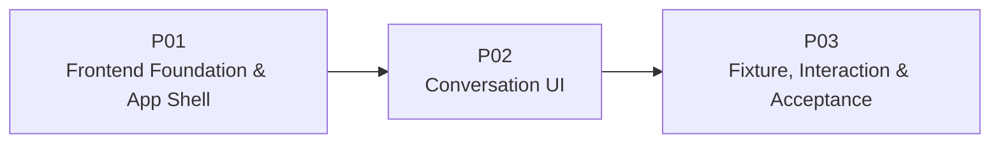

# M01 — Codex UI Prototype PLAN

> 本文把 [SPEC.md](./SPEC.md) 压缩为三个顺序、可运行、可视觉验收的 Plan。质量不再作为独立 Plan；自动测试、视觉检查和构建门禁直接进入每个 Plan 的 Exit Gate，并在 P03 完成最终 M01 Feature Acceptance。

## 1. Plan Status（计划状态）

| Field | Value |
|---|---|
| Milestone / Feature | `M01 — Codex UI Prototype` |
| Status | Ready for TASK decomposition |
| Feature Dependency | None |
| Plan Sequence | `M01-P01 → M01-P02 → M01-P03` |
| Requirements Source | [SPEC.md](./SPEC.md) |
| Visual Source of Truth | [主界面.png](../../references/主界面.png)、[codex缩小界面.png](../../references/codex缩小界面.png) |

## 2. Delivery Strategy（交付策略）



三个 Plan 的累计交付关系：

1. **P01** 先建立可启动、可构建且视觉结构接近参考图的完整 App Shell。
2. **P02** 在稳定 Shell 中加入 Conversation Timeline、Composer 和参考图全部主要可见控件。
3. **P03** 接入六个 Fixture、全部本地交互、UiIntent、回归验证和最终视觉验收。

不再设置独立 Foundation、Presentation、Fixture、Quality 子 Plan。每个 Plan 自己完成测试、构建和人工视觉检查，不把集成或质量问题推迟到 P03。

## 3. Global Constraints（全局约束）

- Frontend 位于 `frontend/`，使用 React、Vite、TypeScript 和 npm。
- 样式使用 CSS Modules + CSS Custom Properties，仅实现浅色主题。
- [主界面.png](../../references/主界面.png) 是完整布局与控件事实源；[codex缩小界面.png](../../references/codex缩小界面.png) 是较窄桌面补充事实源。
- 参考图中主界面所有可见区域和主要控件必须存在；不要求每个按钮具备真实业务功能。
- 视觉评审优先级固定为 Layout → Spacing → Typography → Icon → Border/Radius → Interaction State → Content Density。
- 1440×900 是主要视觉验收视口，1280×720 只验证最低桌面可用性。
- Presentation Model、六个 Fixture Scenario 和四类 UiIntent 使用 SPEC 中的准确名称与取值。
- 不引入 Backend、网络、持久化、Router、真实状态机、异步 Mock Agent、深色主题、移动端、Storybook、Playwright、Tailwind、组件库或全局状态库。
- 每个 Plan 完成时，当前累计应用必须可以启动，全部已有测试和生产构建必须通过。
- TASK 不得通过修改 PROJECT、ARCHITECTURE 或 ROADMAP 来改变 M01 边界。

## 4. Intended Frontend Boundaries（前端责任边界）

```text
frontend/
  package.json
  package-lock.json
  src/
    main.tsx
    app/             # App composition, fixture harness, local UI state
    styles/          # semantic tokens and global styles
    presentation/    # timeline, run status and UiIntent types
    components/
      shell/         # application top bar, sidebar, header, main layout
      conversation/  # messages, reasoning, tools and status
      composer/      # composer and visible bottom controls
      acceptance/    # scenario switcher and intent monitor
    fixtures/        # six deterministic scenarios
    test/            # shared Vitest and RTL setup
```

边界规则：

- `presentation/` 不依赖 `fixtures/`。
- `fixtures/` 可以组合 Presentation Model。
- 展示组件只通过 props 和 callback 接收数据，不导入具体 Scenario。
- `app/` 负责组合 Scenario、局部交互状态和 Acceptance Panel。
- Scenario Switcher 与 Intent Monitor 通过 Conversation Header Overflow 打开；关闭后不能改变参考图主布局。

## 5. Requirement Traceability（需求追踪）

| Requirement | Primary Plan | Supporting / Final Plan | Required Evidence |
|---|---|---|---|
| `M01-R01` Visual Source of Truth 与全部可见区域/控件 | `M01-P01`、`M01-P02` | `M01-P03` | 控件存在测试、逐区视觉核对 |
| `M01-R02` 七级视觉还原优先级 | `M01-P01`、`M01-P02` | `M01-P03` | Token/状态测试、1440×900 视觉评审 |
| `M01-R03` 1440×900 与 1280×720 | `M01-P01` | `M01-P03` | Layout/overflow 测试、两档视口检查 |
| `M01-R04` App Shell 完整 | `M01-P01` | `M01-P03` | Shell RTL 测试、区域关系检查 |
| `M01-R05` Conversation Timeline 完整 | `M01-P02` | `M01-P03` | Timeline 变体测试、Completed 检查 |
| `M01-R06` 顶部、底部和 Composer 主要按钮存在 | `M01-P01`、`M01-P02` | `M01-P03` | Role/Name 测试、图标与位置检查 |
| `M01-R07` 六个 Fixture Scenario | `M01-P03` | — | Fixture invariant 与切换测试 |
| `M01-R08` Conversation/Sidebar/Reasoning/Composer 交互 | `M01-P03` | — | `user-event` 测试、人工操作 |
| `M01-R09` 四类 UiIntent 且无 Runtime 副作用 | `M01-P03` | — | Harness 集成测试、Intent Monitor |
| `M01-R10` 状态、可访问性、长内容和 Reduced Motion | `M01-P02` | `M01-P03` | 语义/键盘/overflow 测试、人工检查 |
| `M01-R11` 安装、启动、测试和构建 | 每个 Plan | `M01-P03` | 全量测试、生产构建、Smoke Check |
| `M01-R12` 不越过 M01 架构范围 | 每个 Plan | `M01-P03` | 依赖与源码检查 |

## 6. M01-P01 — Frontend Foundation & App Shell

### 6.1 Goal

一次性交付前端工程基础和 Codex Desktop App Shell，使应用已经具备参考图中的主要区域、尺寸关系和 Shell 控件，而不是只显示工程占位页。

### 6.2 Depends On

None。

### 6.3 Scope

- Vite、React、TypeScript、npm scripts、Vitest 和 RTL 测试环境。
- 浅色语义 Design Tokens：Surface、Text、Border、Typography、Spacing、Icon、Radius、Shadow、State、Layer、Motion。
- Application Top Bar：
  - Sidebar Toggle、Back、Forward。
  - 文件、编辑、视图、帮助菜单。
  - 窗口式最小化、最大化、关闭按钮。
- Sidebar：
  - Codex 品牌与下拉入口。
  - Search、Notification。
  - New Chat、Pull Request、Sites、Scheduled、Plugins。
  - Pinned、Project、Recent 分组和列表。
  - 当前项、滚动区域、用户 Footer。
  - 280px 展开与 64px 折叠视觉状态；P01 只需展示两态，实际切换接线在 P03。
- Conversation Header：
  - Folder/Workspace、当前标题、Overflow。
  - 参考图右侧全部可见视图/布局按钮。
- Main Conversation Area：
  - Header/Main/Composer Slot 的固定关系。
  - 居中的 840px Timeline 内容列。
  - 独立滚动和空状态区域。
- Composer Shell：
  - 与参考图接近的宽度、圆角、Border、Shadow 和底部位置。
  - P01 只建立容器几何，不实现完整输入和按钮行为。

### 6.4 Outputs

- `npm run dev` 可以打开完整浅色 App Shell。
- `npm run test -- --run` 和 `npm run build` 可运行。
- 1440×900 同时显示 App Top Bar、Sidebar、Conversation Header、Main 和 Composer Shell。
- 1280×720 不发生 Header/Composer 重叠，Sidebar 与 Main 保持独立区域。
- Shell 中参考图可见按钮使用一致的线性图标风格、可见 Focus 状态和 Accessible Name。
- P02 可以只填充 Conversation 和 Composer 内容，不需要重写 Shell。

### 6.5 Automated Verification

- App Smoke Test 验证应用成功渲染。
- Role/Name 测试验证 Shell 主要区域和按钮存在。
- Token Contract Test 验证视觉类别完整。
- Layout State 测试验证 Sidebar 展开/折叠 class、Header、Main 和 Composer Slot。
- 执行：

```powershell
cd frontend
npm run test -- --run
npm run build
```

### 6.6 Visual and Human Verification

在 1440×900 对照参考图检查：

1. Application Top Bar、Sidebar、Header、Main、Composer Shell 的区域比例。
2. Sidebar 分组密度、选中项、图标和 Footer。
3. Header 高度、标题截断、右侧按钮间距。
4. Main 留白、内容列位置和 Composer 悬浮关系。
5. Border、Radius、Shadow 和浅色 Surface 层级。

在 1280×720 检查无区域重叠、主要 Shell 控件可见、Main 可以独立滚动。

### 6.7 Exit Gate

- `M01-R03`、`M01-R04` 具有自动和人工证据。
- `M01-R01`、`M01-R02`、`M01-R06` 的 Shell 部分没有 Layout 或 Spacing 阻断项。
- Shell 所有主要 Icon Button 具有 Accessible Name。
- 全量测试与生产构建返回退出码 0。
- 依赖中不存在禁止项，源码没有 Backend、网络、持久化或 Router。
- P01 Gate 通过后才展开 P02 TASK。

## 7. M01-P02 — Conversation UI

### 7.1 Goal

在稳定 App Shell 中交付完整 Codex Conversation UI，包括 Presentation Model、所有 Timeline 组件、Run 状态、完整 Composer 和参考图中的主要会话操作按钮。

### 7.2 Depends On

`M01-P01`。

### 7.3 Scope

- 保留并实现 SPEC 定义的 Presentation Model：
  - `RunPresentationStatus`
  - `TimelineItemKind`
  - `ToolPresentationStatus`
  - `ToolResultOutcome`
  - `ComposerMode`
  - `UiIntent` callback contract
- User Message：
  - 右对齐浅灰消息面板、时间和可见辅助操作。
- Assistant Message：
  - 正文、Partial 状态、时间/耗时、分隔线、反馈与辅助按钮。
- Reasoning：
  - Title、正文、Active/Completed、展开/收起视觉状态。
- Tool Call：
  - Tool Name、Summary、Input、Status、Waiting Approval 操作。
- Tool Result：
  - Success、Failed、Cancelled 和受限预格式化内容。
- Status Notice：
  - Running、Waiting Approval、Failed、Cancelled。
- 完整 Composer：
  - Textarea。
  - Attachment。
  - Permission/Access。
  - 状态指示。
  - Model Selector。
  - Microphone。
  - Send / Stop。
- 所有参考图可见会话区辅助按钮：
  - 必须具有正确位置、图标、Hover/Focus/Disabled 状态和 Accessible Name。
  - 无业务功能的按钮不执行网络或持久化行为。
- 使用静态 Completed 展示数据完成 Timeline 集成；完整 Scenario Harness 在 P03 接入。

### 7.4 Outputs

- 六类 Timeline Item 可以由纯 props 渲染。
- Conversation UI 在 App Shell 内形成与参考图接近的内容宽度、对齐、间距和密度。
- Composer 的 Enabled、Disabled Running、Disabled Waiting Approval 三种视觉状态完整。
- 组件通过 callback 暴露 Submit、Stop、Approve、Deny，但 P02 不实现 Harness 状态变化。
- 长消息、长 URL、Tool Input/Result 不扩大页面整体宽度。
- Completed 静态展示可用于 1440×900 Conversation 视觉比较。

### 7.5 Automated Verification

- 每个 Timeline Kind 至少一个渲染测试。
- User/Assistant 对齐和 Partial 状态测试。
- Reasoning Expanded/Collapsed/Active 状态测试。
- Tool Call/Result 全部状态和 Permission callback 测试。
- Composer 空白、输入、Enter、Shift+Enter、禁用、Submit/Stop callback 测试。
- Role/Name 测试验证 Attachment、Model Selector、Microphone、Send/Stop 和辅助按钮存在。
- 语义、键盘、长内容和 Reduced Motion 测试。
- 执行全量测试与生产构建。

### 7.6 Visual and Human Verification

在 1440×900 使用 Completed 静态展示，对照参考图依次检查：

1. User Message 宽度、对齐、Surface 和 Radius。
2. Reasoning 面板的 Typography、Spacing 和折叠控制。
3. Assistant 正文、耗时、分隔线和辅助操作密度。
4. Tool Call / Tool Result 的信息层级和状态。
5. Composer 输入高度、Shadow、Attachment、Permission、Model、Microphone、Send/Stop。
6. Hover、Focus、Selected、Expanded、Disabled 和各 Run 状态。

在 1280×720 检查 Timeline 与 Composer 不重叠，长内容可滚动，主要按钮仍可操作。

### 7.7 Exit Gate

- `M01-R05` 和 `M01-R10` 具有自动与人工证据。
- `M01-R01`、`M01-R02`、`M01-R06` 的 Conversation 和 Composer 部分没有 Layout、Spacing 或 Typography 阻断项。
- Presentation Model 名称和取值与 SPEC 完全一致。
- 所有主要可见按钮存在；没有业务功能的按钮仍具备正确视觉和可访问名称。
- 全量测试与生产构建返回退出码 0。
- P02 累计 UI 可独立展示完整 Completed Conversation，P03 不需要重写视觉组件。

## 8. M01-P03 — Fixture, Interaction & Acceptance

### 8.1 Goal

把完整静态 UI 接入六个确定性 Scenario 和本地交互，完成 UiIntent Harness、回归验证、两档视口检查和最终 M01 Feature Acceptance。

### 8.2 Depends On

`M01-P02`。

### 8.3 Scope

- 六个 Fixture Scenario：
  - `empty`
  - `completed`
  - `running`
  - `waiting-approval`
  - `failed`
  - `cancelled`
- Acceptance Panel：
  - 通过 Conversation Header Overflow 打开。
  - Scenario Switcher。
  - 当前场景名称与说明。
  - Intent Monitor。
  - 默认关闭，关闭时不改变参考图主布局。
- Local Interaction：
  - Conversation Switch。
  - Sidebar Collapse。
  - Reasoning Toggle。
  - Composer 输入、换行、提交和清空。
  - Submit / Stop / Approve / Deny。
- UiIntent：
  - `composer.submit`
  - `run.stop`
  - `permission.approve`
  - `permission.deny`
- 状态重置：
  - Scenario 切换时恢复默认会话、Sidebar、Reasoning、Composer 和 Intent。
- Regression：
  - Fixture invariant。
  - Scenario switch。
  - Shell + Conversation + Composer 集成。
  - Keyboard、Accessible Name、overflow 和 Reduced Motion。
- Final Build 与人工视觉验收。

### 8.4 Outputs

- 默认启动 `completed` Scenario，Acceptance Panel 关闭。
- 六个 Scenario 可确定性切换，不使用网络、当前时间、随机数或计时器。
- Conversation、Sidebar、Reasoning、Composer 按 SPEC 本地交互。
- 四类 UiIntent payload 正确显示在 Intent Monitor 中。
- UiIntent 不追加 Timeline、不改变 Run Status、不执行工具。
- 1440×900 和 1280×720 验收路径完整。
- `M01-R01` 至 `M01-R12` 全部有证据。

### 8.5 Automated Verification

- Fixture invariant：
  - 六个 Scenario ID 完整且唯一。
  - Active Conversation 引用有效。
  - Tool Result 引用已经出现的 Tool Call。
  - Run Status 与 Composer Mode 匹配。
- Scenario Switching：
  - 默认 Completed。
  - 切换后恢复默认局部状态。
- Local Interaction：
  - Conversation、Sidebar、Reasoning、Composer。
- UiIntent：
  - 类型和 payload 正确。
  - Timeline 数量、Scenario 和 Run Status 不变。
- Regression：
  - 所有 Shell 区域、Timeline Kind、Composer Mode、Scenario 和 UiIntent 均有测试引用。
  - 不存在被跳过的关键测试。
- Final Commands：

```powershell
cd frontend
npm run test -- --run
npm run build
```

### 8.6 Final Visual Acceptance

#### 1440×900

1. 使用默认 Completed，关闭 Acceptance Panel。
2. 对照两张参考图逐区确认所有可见区域和主要控件。
3. 按 Layout → Spacing → Typography → Icon → Border/Radius → Interaction State → Content Density 评审。
4. Layout、Spacing、Typography 任何阻断项都必须在验收前修复。
5. 打开 Acceptance Panel，切换六个 Scenario 并检查状态。
6. 检查 Hover、Focus、Selected、Expanded、Disabled、Running、Waiting Approval、Failed、Cancelled。

#### 1280×720

1. 检查 Sidebar 展开和折叠。
2. 检查 Header、Timeline、Composer 无重叠。
3. 检查长消息、代码、Tool Input/Result 的滚动和裁切。
4. 只用键盘完成场景切换、会话切换、Reasoning、Composer 和当前场景操作。
5. 检查所有主要按钮仍可见或可到达。

### 8.7 Exit Gate / M01 Feature Acceptance

- P01、P02、P03 的全部自动测试和人工检查通过。
- `npm run test -- --run` 与 `npm run build` 的最新完整运行返回退出码 0。
- `M01-R01` 至 `M01-R12` 没有证据缺口。
- 参考图所有可见区域和主要控件已经实现。
- 1440×900 没有 Layout、Spacing、Typography 阻断项。
- 1280×720 满足最低桌面可用性。
- 六个 Scenario、四类 UiIntent、Conversation Switch、Sidebar Collapse、Reasoning Toggle 和 Composer 行为正确。
- 无功能按钮没有伪造业务结果，且具备正确视觉状态和 Accessible Name。
- 依赖与源码检查确认没有 Backend、网络、持久化、Router 或异步 Agent Runtime。
- 人工验收通过后，M01 才可以标记完成并进入 M02。

## 9. TASK Handoff Rules（TASK 交接规则）

后续生成 `TASK.md` 时：

- 一次只展开当前 Plan，不再创建新的中间 Plan。
- P01、P02、P03 各自包含实现、测试、构建和视觉验收 TASK。
- 不单独创建 Quality、Regression 或 Acceptance Plan；它们属于当前 Plan 的 Exit Gate。
- TASK 使用 ROADMAP 规定字段：

```text
task_id
goal
depends_on
write_scope
expected_output
verification
wave
status
```

- 同一 Wave 避免修改相同文件；公共 Token、Presentation Model 和组件接口先于消费者完成。
- 每个 TASK 明确自动验证和必要的人工视觉检查。
- 每个 Plan 结束时运行全量测试、生产构建，并完成对应参考图检查。
- P03 Gate 通过后直接进入 M01 Feature Acceptance，不再增加 P04 或 P05。
