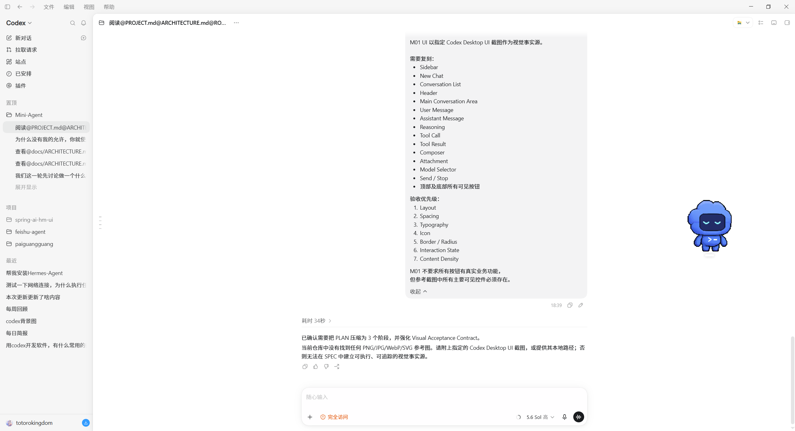
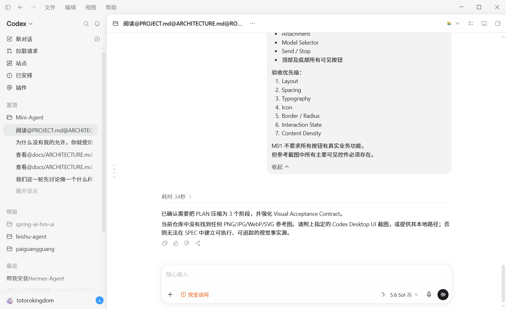

# M01 — Codex UI Prototype SPEC

## 1. Document Status（文档状态）

| Field | Value |
|---|---|
| Milestone / Feature | `M01 — Codex UI Prototype` |
| Status | Ready for TASK decomposition |
| Depends On | None |
| Source | [PROJECT.md](../../PROJECT.md)、[ARCHITECTURE.md](../../ARCHITECTURE.md)、[ROADMAP.md](../../ROADMAP.md) |
| Visual Source of Truth | [主界面.png](../../references/主界面.png)、[codex缩小界面.png](../../references/codex缩小界面.png) |

本 SPEC 是 M01 的需求与视觉事实源。PLAN 和 TASK 可以细化实现步骤，但不得隐式改变本文的视觉范围、Presentation Model（展示模型）、Fixture Scenario（固定场景）、UiIntent（界面意图）或验收标准。

## 2. Goal and Deliverable（目标与交付物）

### 2.1 Goal

建立高完成度、可启动、可交互的 Codex Desktop-like React UI Prototype（界面原型）。M01 使用固定 Fixture 提前展示完整 Agent Run 过程，重点验证界面结构、视觉还原、内容密度和交互状态，不连接 Backend，也不实现真实 Agent Runtime。

### 2.2 Deliverable

交付一个位于 `frontend/` 的浅色桌面单页应用：

- 主界面的可见区域、主要控件和信息层级与参考图保持一致。
- User、Assistant、Reasoning、Tool Call、Tool Result 和 Run Status 可以完整展示。
- 六个 Fixture Scenario 可以从应用内切换。
- 会话选择、Sidebar 折叠、Reasoning 展开收起、Composer 输入及四类 UiIntent 可以本地演示。
- 1440×900 通过主要视觉验收，1280×720 保持最低桌面可用性。
- 核心组件、交互和 Fixture 具有自动测试，生产构建通过。

## 3. Visual Acceptance Contract（视觉验收契约）

### 3.1 Visual Source of Truth（视觉事实源）

以下截图共同构成 M01 的 Visual Reference Set（视觉参考集）：

1. **[主界面.png](../../references/主界面.png)**：主要视觉事实源，定义完整桌面界面的区域、控件、视觉层级和内容密度。
2. **[codex缩小界面.png](../../references/codex缩小界面.png)**：补充事实源，定义较窄桌面下 Sidebar、Conversation、Composer、滚动条和留白的相对关系。

事实源优先级：

1. 参考图决定“看起来是什么样”和“哪些可见控件必须存在”。
2. 本 SPEC 决定 M01 中哪些控件需要本地交互，以及数据和状态如何表达。
3. PLAN 和 TASK 决定实现顺序，不得降低视觉覆盖范围。

截图分辨率与目标验收视口不同，因此 M01 要求按比例和视觉关系还原，不要求逐像素复制截图坐标。任何明显偏离都必须能由可访问性、目标视口可用性或技术边界解释。

### 3.2 Required Visible Regions and Controls（必须实现的可见区域与控件）

参考图中属于 Codex 主界面的可见区域和主要控件必须存在。M01 至少覆盖：

| Region | Required Visible Content |
|---|---|
| Application Top Bar | Sidebar Toggle、Back、Forward、文件/编辑/视图/帮助菜单、窗口式最小化/最大化/关闭按钮 |
| Sidebar Header | Codex 品牌与下拉入口、Search、Notification |
| Sidebar Primary Actions | New Chat、Pull Request、Sites、Scheduled、Plugins 及对应图标 |
| Sidebar Collections | Pinned、Project、Recent 分组，会话/项目列表、当前项高亮、滚动区域 |
| Sidebar Footer | 用户头像与名称、底部状态/操作按钮 |
| Conversation Header | Folder/Workspace 图标、当前会话标题、Overflow、右侧所有可见视图/布局类按钮 |
| Main Conversation Area | 居中的 Timeline 内容列、独立滚动区域、段落间距和留白 |
| User Message | 右侧对齐的浅灰消息面板、时间和可见辅助操作 |
| Assistant Message | 正文、时间/耗时、分隔线和可见反馈/操作按钮 |
| Reasoning | 可展开标题、正文面板、Active/Completed 状态和收起控制 |
| Tool Call | 工具名称、摘要、输入、状态及 Waiting Approval 操作 |
| Tool Result | Success、Failed、Cancelled 结果和受限的预格式化内容 |
| Composer | 圆角输入面板、Attachment、Permission/Access、状态指示、Model Selector、Microphone、Send / Stop |
| Acceptance Controls | Scenario Switcher 与 Intent Monitor；通过 Header Overflow 打开的验收面板承载，关闭时不改变参考图主布局 |

顶部窗口式按钮只需作为 React UI 的视觉控件存在，不要求控制真实操作系统窗口。Search、Notification、New Chat、Pull Request、Sites、Scheduled、Plugins、Attachment、Model Selector、Microphone、布局按钮等不要求具备真实业务功能，但必须：

- 在正确区域出现。
- 使用与参考图相近的图标、尺寸、间距和状态。
- 具有明确 Accessible Name（可访问名称）。
- 不以虚假加载、网络请求或持久化模拟业务结果。

### 3.3 Visual Fidelity Priority（视觉还原优先级）

人工评审按以下顺序判断；高优先级问题未解决时，不以低优先级细节抵消：

1. **Layout（布局）**：区域划分、Sidebar/Main 比例、Header/Composer 固定关系、内容列位置、滚动边界。
2. **Spacing（间距）**：区域内边距、列表行距、消息间距、Composer 与内容的距离。
3. **Typography（排版）**：字体层级、字号、行高、字重、标题和辅助文本差异。
4. **Icon（图标）**：图标语义、风格、大小、线宽、按钮内对齐。
5. **Border / Radius（边框与圆角）**：分隔线、面板边界、消息与 Composer 圆角、选中项轮廓。
6. **Interaction State（交互状态）**：Hover、Focus、Selected、Expanded、Disabled、Running、Waiting Approval、Failed、Cancelled。
7. **Content Density（内容密度）**：Sidebar 列表数量、Timeline 信息量、留白与可见内容比例。

### 3.4 Viewport Acceptance（视口验收）

#### 1440×900 — Primary Visual Acceptance

- 作为 M01 主要视觉验收视口。
- 默认打开 `completed` Scenario，并关闭 Acceptance Panel。
- 对照两张参考图检查完整区域、控件覆盖和七级视觉优先级。
- App Top Bar、Sidebar、Conversation Header、Timeline 和 Composer 必须同时可见。
- 页面根节点不产生纵向滚动；Sidebar 与 Conversation Area 各自按参考图处理滚动。

#### 1280×720 — Minimum Desktop Usability

- 验证最低桌面可用性，不要求与 1440×900 拥有相同可见内容数量。
- Header 和 Composer 不得互相覆盖，主要按钮不得被裁切到不可操作。
- Sidebar 保持可折叠；Conversation Area 保持独立滚动。
- 长消息、代码、Tool Input/Result 不得扩大页面整体宽度。
- 用户必须能通过键盘到达 Scenario Switcher、Conversation、Composer 和当前场景的主要操作。

### 3.5 Visual Acceptance Method（视觉验收方式）

每次 Plan Exit Gate 和最终 Feature Acceptance 都必须：

1. 使用固定 Fixture 和固定视口打开应用。
2. 将 Acceptance Panel 关闭后，与参考图并排比较。
3. 按 Visual Fidelity Priority 从上到下记录差异。
4. 先修复 Layout、Spacing 和 Typography 阻断项，再处理图标与装饰细节。
5. 对 Hover、Focus、Selected、Expanded、Disabled 和 Run 状态进行单独检查。
6. 在 1280×720 复核滚动、裁切、焦点和 Composer 可用性。

M01 不要求 Screenshot Diff（截图差异）自动化；最终视觉结论由人工验收给出。

## 4. Scope（范围）

### 4.1 In Scope

- React、Vite、TypeScript 和 npm 前端工程。
- CSS Modules + CSS Custom Properties（CSS 自定义属性）。
- 仅浅色主题的语义化 Design Tokens（设计令牌）。
- 参考图中的 Application Top Bar、Sidebar、Conversation Header、Main Conversation Area 和 Composer。
- 参考图中的所有主要可见按钮和控件。
- User Message、Assistant Message、Reasoning、Tool Call、Tool Result、Status Notice。
- 六个固定 Fixture Scenario。
- 本地展示状态、UiIntent 和 Acceptance Panel。
- Vitest、React Testing Library、`user-event`、`jest-dom`。
- 1440×900 主要视觉验收和 1280×720 最低可用性验收。

### 4.2 Out of Scope

- Python Backend、FastAPI、REST、SSE 和网络请求。
- SQLite、Local Storage 或其他持久化。
- 真实 Workspace、Conversation、Session、Run CRUD。
- Backend API Schema、Runtime Event Reducer 和流式重连。
- 真实或异步 Mock Agent、计时器驱动的状态转换。
- 参考图中按钮对应的真实 Search、Notification、Pull Request、Sites、Scheduled、Plugin、Attachment、Model 或 Voice 功能。
- 深色主题、主题切换、移动端和平板布局。
- Storybook、Playwright、Tailwind、第三方组件库和全局状态库。

## 5. Technical Baseline（技术基线）

- Application：React + Vite + TypeScript。
- Package manager：npm。
- Styling：CSS Modules + CSS Custom Properties。
- Icons：优先使用 `lucide-react` 中与参考图语义和线性风格接近的图标。
- Tests：Vitest + React Testing Library + `user-event` + `jest-dom`。
- Required commands：`npm run dev`、`npm run test -- --run`、`npm run build`。
- Theme：仅浅色；Token 覆盖 Surface、Text、Border、State、Typography、Spacing、Radius、Shadow、Layer 和 Motion。
- Fixture 用户可见文案使用简体中文，必要英文技术名词附中文含义。

M01 不固定截图中的产品品牌资产或系统字体文件；应使用可合法随项目分发的字体栈和图标，在不增加重型 UI 依赖的前提下尽量贴近参考图。

## 6. Layout and Component Contract（布局与组件契约）

### 6.1 Layout Baseline

- 根布局高度为 `100dvh`。
- Application Top Bar 模拟参考图的桌面窗口顶部结构。
- Sidebar 默认宽度 280px，折叠后宽度 64px。
- Conversation Header 高度 56px。
- Main Conversation Area 独立纵向滚动。
- Timeline 内容列最大宽度 840px，并在 Main 中水平居中。
- Composer 位于 Main 底部，保持参考图中的宽度、圆角、阴影和悬浮关系，不覆盖最后一个 Timeline Item。
- Acceptance Panel 默认关闭，通过 Conversation Header Overflow 打开。

### 6.2 Component Responsibilities

| Component Group | Responsibility |
|---|---|
| App Shell | Application Top Bar、Sidebar、Conversation Header、Main、Composer Slot 的整体布局 |
| Sidebar | 品牌、主要动作、分组列表、当前会话、折叠和 Footer |
| Conversation Header | 当前标题、Overflow、右侧所有可见按钮、Acceptance Panel 入口 |
| Conversation View | Timeline、空状态和独立滚动 |
| User / Assistant Message | 对齐、正文、时间、辅助操作和 Partial 状态 |
| Reasoning | 展开/收起、Active/Completed 状态、正文 |
| Tool Call / Result | 工具信息、状态、输入、结果和审批操作 |
| Status Notice | Running、Waiting Approval、Failed、Cancelled 的文本与视觉表达 |
| Composer | 输入、Attachment、Permission、Model、Microphone、Send / Stop 及禁用状态 |
| Acceptance Panel | Scenario Switcher、当前场景说明和 Intent Monitor |

## 7. Presentation Model（展示模型）

以下类型只服务前端展示和 Fixture，不是 Backend API 或 Runtime Event Schema。

### 7.1 Scalar Contracts

| Contract | Allowed Values |
|---|---|
| `ScenarioId` | `empty`、`completed`、`running`、`waiting-approval`、`failed`、`cancelled` |
| `RunPresentationStatus` | `idle`、`running`、`waiting_approval`、`completed`、`failed`、`cancelled` |
| `TimelineItemKind` | `user-message`、`assistant-message`、`reasoning`、`tool-call`、`tool-result`、`status-notice` |
| `ToolPresentationStatus` | `requested`、`waiting_approval`、`running`、`completed`、`failed`、`denied`、`cancelled` |
| `ToolResultOutcome` | `success`、`failed`、`cancelled` |
| `ComposerMode` | `enabled`、`disabled_running`、`disabled_waiting_approval` |

### 7.2 TimelineItem

每个 Timeline Item 具有稳定 `id` 和 `kind`。最小字段：

| Kind | Required Fields |
|---|---|
| `user-message` | `content`、`createdAtLabel` |
| `assistant-message` | `content`、`createdAtLabel`、`isPartial` |
| `reasoning` | `title`、`content`、`defaultExpanded`、`isActive` |
| `tool-call` | `toolCallId`、`toolName`、`summary`、`input`、`status`、`requiresApproval` |
| `tool-result` | `toolCallId`、`outcome`、`content`、`durationLabel` |
| `status-notice` | `tone`、`title`、`description` |

Timeline 顺序就是视觉与语义阅读顺序。`tool-result.toolCallId` 必须引用同一 Timeline 中已经出现的 Tool Call。

### 7.3 UiScenario

每个 `UiScenario` 包含：

- `id: ScenarioId`
- `name` 和 `description`
- `runStatus: RunPresentationStatus`
- `conversations: ConversationFixture[]`
- `activeConversationId: string | null`
- `composerMode: ComposerMode`

Fixture 使用固定 ID、固定时间文案和固定内容，不使用当前时间、随机数或网络数据。

### 7.4 UiIntent

| Intent Type | Payload | Trigger |
|---|---|---|
| `composer.submit` | 去除首尾空白后的非空 `content` | Composer 提交 |
| `run.stop` | 无 | Running 或 Waiting Approval 点击 Stop |
| `permission.approve` | `toolCallId` | 待审批 Tool Call 点击 Approve |
| `permission.deny` | `toolCallId` | 待审批 Tool Call 点击 Deny |

Harness 接收 UiIntent 后只更新 Intent Monitor，不追加 Timeline、不改变 Run Status、不执行工具、不发起网络请求。

## 8. Fixture Scenarios（固定场景）

| Scenario | Required Content | Run Status | Composer |
|---|---|---|---|
| `empty` | 无活动会话；展示与参考图风格一致的空态 | `idle` | `enabled` |
| `completed` | 至少两个会话；活动会话完整展示 User → Reasoning → Tool Call → Tool Result → Assistant | `completed` | `enabled` |
| `running` | User、默认展开且 Active 的 Reasoning、Running 状态、Stop | `running` | `disabled_running` |
| `waiting-approval` | User、Reasoning、待审批 Tool Call、Approve/Deny/Stop | `waiting_approval` | `disabled_waiting_approval` |
| `failed` | 已产生过程、失败结果或 Partial Assistant、明确失败状态 | `failed` | `enabled` |
| `cancelled` | 已产生过程、Partial Assistant、明确取消状态 | `cancelled` | `enabled` |

默认 Scenario 为 `completed`。Acceptance Panel 关闭后，默认画面用于 1440×900 视觉验收。

## 9. Interaction Contract（交互契约）

- Scenario Switcher：通过 Header Overflow 打开 Acceptance Panel；切换后恢复 Fixture 默认会话、Reasoning、Sidebar、Composer 和 Intent 状态。
- Conversation Switch：同步更新 Sidebar 选中项、Conversation Header 和 Timeline。
- Sidebar Collapse：在 280px 和 64px 间切换，不改变当前会话。
- Reasoning Toggle：每个 Reasoning 可以独立展开/收起；Active 状态不只依赖颜色或动效。
- Composer：空白不可提交；`Enter` 提交；`Shift+Enter` 换行；提交后清空草稿。
- Running / Waiting Approval：Composer 禁用并说明原因；Stop 发出 `run.stop`。
- Waiting Approval：Approve 和 Deny 分别发出对应 Permission UiIntent。
- Intent Monitor：以 `aria-live` 显示最近 UiIntent；不改变 Fixture 状态。
- 其他参考图可见按钮：保持正确视觉、Hover/Focus 状态和 Accessible Name，不要求业务功能。

## 10. Accessibility, Overflow and State（可访问性、溢出与状态）

- Application Top Bar、Sidebar、Header、Main 和 Composer 使用合理语义区域。
- 所有真实交互可以通过键盘触发，Icon Button 具有 Accessible Name。
- Focus、Selected、Expanded、Disabled、Running、Waiting Approval、Failed、Cancelled 不能只用颜色表达。
- Text、Border、Icon 和 Focus Token 以 WCAG AA 对比度为目标。
- 长消息、长 URL、代码、Tool Input/Result 在自身容器内换行或横向滚动。
- 动效支持 `prefers-reduced-motion`；关闭动效后不丢失状态含义。
- Failed 和 Cancelled 保留已经产生的内容，并使用不同文案与视觉强度。

## 11. Requirements and Acceptance Matrix（需求与验收矩阵）

| ID | Requirement | Automated Evidence | Human Evidence |
|---|---|---|---|
| `M01-R01` | 两张参考图是 Visual Source of Truth，主界面所有可见区域和主要控件均被覆盖 | Shell/Control presence tests | 与参考图逐区核对 |
| `M01-R02` | Layout、Spacing、Typography、Icon、Border/Radius、Interaction State、Content Density 按优先级贴近参考图 | 状态与 Token contract tests | 1440×900 七级视觉评审 |
| `M01-R03` | 1440×900 通过主要视觉验收，1280×720 保持最低桌面可用性 | Layout state/overflow tests | 两档视口检查 |
| `M01-R04` | App Top Bar、Sidebar、Conversation Header、Main 和 Composer Shell 完整 | RTL shell tests | 区域比例、滚动与固定关系检查 |
| `M01-R05` | User、Assistant、Reasoning、Tool Call、Tool Result、Status 均按 Presentation Model 渲染 | Timeline variant tests | Completed 场景逐项检查 |
| `M01-R06` | Attachment、Model Selector、Send / Stop 及顶部、底部主要按钮均存在 | Role/name presence tests | 对照参考图检查图标、位置和状态 |
| `M01-R07` | 六个 Fixture Scenario 确定性可用并正确重置 | Fixture invariant / switch tests | 逐场景检查 |
| `M01-R08` | Conversation、Sidebar、Reasoning 和 Composer 本地交互正确 | `user-event` tests | 键盘与鼠标操作 |
| `M01-R09` | 四类 UiIntent payload 正确且无 Runtime 副作用 | Harness integration tests | Intent Monitor 检查 |
| `M01-R10` | 状态、可访问性、长内容和 Reduced Motion 不破坏可用性 | Semantic/keyboard/overflow tests | 焦点、状态和滚动检查 |
| `M01-R11` | 前端可以安装、启动、测试和构建 | `npm run test -- --run`、`npm run build` | 启动 Smoke Check |
| `M01-R12` | M01 不包含 Backend、网络、持久化、Router 或真实/异步 Agent Runtime | Dependency/source inspection | 架构一致性审查 |

## 12. Definition of Done（完成定义）

M01 只有同时满足以下条件才可以提交 Feature Acceptance：

- `M01-R01` 至 `M01-R12` 均有自动或人工证据。
- P01、P02、P03 各自 Exit Gate 已通过。
- `completed` Scenario 在 1440×900 与参考图完成七级视觉对比，没有 Layout、Spacing 或 Typography 阻断项。
- 1280×720 下 Sidebar、Conversation、Composer、滚动和主要操作可用。
- 六个 Scenario、四类 UiIntent 和保留的 Presentation Model 通过测试。
- `npm run test -- --run` 与 `npm run build` 返回退出码 0。
- 主界面所有参考图可见区域和主要控件存在；未实现业务功能的按钮仍有正确视觉和 Accessible Name。
- 实际实现没有提前引入 M02–M05 的 Backend、Event 或 Runtime 能力。
