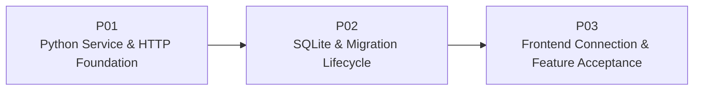

# M02 — Backend Foundation PLAN

> 本文把 [SPEC.md](./SPEC.md) 划分为三个顺序、可启动、可测试的集成 Plan。PLAN 保持阶段级粒度；具体 Module、Test Case 和文件级实现步骤由后续当前 Plan 的 TASK 再拆分。质量与验收直接进入每个 Plan 的 Exit Gate，不单独设置 Quality Plan。

## 1. Plan Status（计划状态）

| Field | Value |
|---|---|
| Milestone / Feature | `M02 — Backend Foundation` |
| Status | Ready for TASK decomposition |
| Feature Dependency | `M01 — UI Foundation` |
| Plan Sequence | `M02-P01 → M02-P02 → M02-P03` |
| Requirements Source | [SPEC.md](./SPEC.md) |
| Architecture Source | [ARCHITECTURE.md](../../ARCHITECTURE.md) |

## 2. Delivery Strategy（交付策略）



三个 Plan 的累计交付关系：

1. **P01** 建立可安装、可启动和可测试的 FastAPI 服务，固定配置、Application Factory、Lifespan 结构、CORS 与 Health HTTP 基础契约。
2. **P02** 把 SQLite Connection、Transaction 和 Migration Runner 接入 Lifespan，使 Health Contract 反映真实数据库与 Schema Version。
3. **P03** 接入前端 Health Client 与连接状态 UI，完成前后端联合回归、空库/重复启动演示和 M02 Feature Acceptance。

三段分别形成“可访问服务”“可持久启动服务”“UI 可观察的完整增量”。P03 只做前端接入与累计验收，不承接 P01/P02 应完成的后端测试债务。

## 3. Global Constraints（全局约束）

- M02 只实现 [SPEC.md](./SPEC.md) 定义的 Backend Foundation，不引入 M03+ 领域能力。
- Python Service 位于 `backend/`，使用 Python `>=3.11`、FastAPI、Pydantic Settings、标准库 `sqlite3` 和 pytest。
- `backend/pyproject.toml` 是 Python 依赖与测试配置的单一事实源。
- 所有可变后端配置从 `config.py` 读取；其他模块不直接调用 `os.getenv` 或读取 `.env`。
- Import 无 Filesystem/Database 副作用；目录创建、Migration 和 Dependency Wiring（依赖装配）发生在 Lifespan。
- API 层不包含 SQL；`sqlite3` 类型不泄漏到前端或未来 Core/Harness 公共契约。
- `schema_versions` 是 M02 唯一持久化表，最终 Production Registry（生产迁移注册表）仅包含 Version `1`。
- 前端只有 `src/api/` 可以直接调用 `fetch`；M01 的 Presentation/Fixture 与纯展示边界保持无网络依赖。
- Backend Connection 只影响连接提示，不驱动 Scenario、Timeline、Composer 或 UiIntent。
- 每个 Plan 都包含相关自动测试、启动 Smoke Path（冒烟路径）和 Git 范围检查。
- TASK 不得通过修改 PROJECT、ARCHITECTURE 或 ROADMAP 来扩大 M02 范围；若公共架构决策确需改变，应先回到 SPEC/Architecture 评审。

## 4. Intended Change Boundaries（预期改动边界）

```text
backend/
  pyproject.toml
  .env.example
  src/mini_agent/
    config.py
    __main__.py
    api/
    infrastructure/sqlite/
  tests/

frontend/src/
  api/                       # M02 新增：唯一 HTTP 边界
  app/                       # 连接状态组合
  components/shell/          # 连接状态展示
  test/                      # M01 边界测试演进与 M02 回归
```

后续 TASK 可以调整文件名，但必须保持以下 Seam（接缝）：

- App Factory 接收可注入 Settings。
- Health Route 通过依赖访问 Database Probe，不直接打开数据库。
- Migration Runner 接收 Connection/Registry/Clock 等可测试输入，不依赖 FastAPI Request。
- Frontend Health Client 可注入 Base URL、Fetch 和取消信号；Component 只消费连接状态与 Retry Callback。
- 不创建抽象 Repository Base Class，也不创建未来领域目录的空壳。

## 5. Requirement Traceability（需求追踪）

| Requirement | Primary Plan | Supporting / Final Plan | Required Evidence |
|---|---|---|---|
| `M02-R01` Python 服务安装、测试与启动 | `M02-P01` | `M02-P03` | Import/startup tests、人工启动 |
| `M02-R02` Settings 契约 | `M02-P01` | `M02-P03` | 默认/覆盖/无效配置测试 |
| `M02-R03` Lifespan 顺序与启动失败 | `M02-P01`、`M02-P02` | `M02-P03` | Lifespan 集成测试、失败演示 |
| `M02-R04` Health 与 CORS | `M02-P01`、`M02-P02` | `M02-P03` | API Contract/CORS tests |
| `M02-R05` SQLite Connection/Transaction | `M02-P02` | — | PRAGMA、Commit、Rollback、Close tests |
| `M02-R06` Migration 全部不变量 | `M02-P02` | `M02-P03` | Migration fixture、空库/重启证据 |
| `M02-R07` Frontend API Client | `M02-P03` | — | Client 与 Source Boundary tests |
| `M02-R08` 三态连接 UI 与 Retry | `M02-P03` | — | Component/App tests、人工断开恢复 |
| `M02-R09` M01 Fixture/UiIntent 不回归 | `M02-P03` | — | M01 全量回归、人工抽查 |
| `M02-R10` 运行时文件与信息暴露边界 | 每个 Plan | `M02-P03` | Ignore/response/status checks |
| `M02-R11` 无未来领域能力 | 每个 Plan | `M02-P03` | Schema/source/architecture inspection |

## 6. M02-P01 — Python Service & HTTP Foundation

### 6.1 Goal

交付一个可安装、可配置、可测试并能从统一入口启动的最小 FastAPI Service（服务），先固定 HTTP、配置和生命周期装配边界，为 P02 接入真实数据库启动依赖做好准备。

### 6.2 Depends On

`M01 — UI Foundation` 已完成；本 Plan 不修改 M01 Fixture 行为。

### 6.3 Scope

- 创建 `backend/` Python Project 与 `src` Layout（源码布局）。
- 定义 Runtime/Dev/Test Dependencies（运行、开发、测试依赖）与 pytest 配置。
- 实现集中 Settings：Environment、Host、Port、Data Directory、CORS Origins、Log Level。
- 固定相对 Data Directory 基于 `backend/` 解析的规则。
- 提供 `create_app(settings=None)` 和唯一启动入口。
- 建立 Lifespan 的依赖装配结构；P01 只装配当前 HTTP Foundation，不伪造数据库 Ready。
- 增加 `/api/health` Route 与类型化 Response Model 的基础实现。
- 配置明确的 CORS Allowlist。
- 提供 `.env.example` 和运行时文件 Ignore 规则，不包含秘密。
- 建立 Backend Unit/Integration Test（单元/集成测试）目录和最小命令。

### 6.4 Contract Staging（契约分阶段规则）

P01 可以在测试中使用可注入的 Database Probe Stub（数据库探测桩）验证最终 `200/503` Health Schema，但本地默认启动在 P02 接入真实 SQLite 前不作为 M02 最终 Ready 演示。不得添加硬编码的“数据库已就绪”占位实现，也不得创建临时公开 Endpoint。

这允许 P01 固定最终 HTTP Contract，同时保持“Ready 必须来自真实数据库”的事实不被破坏。

### 6.5 Outputs

- 在干净 Virtual Environment（虚拟环境）中可安装 Backend Dependencies。
- `python -m mini_agent` 与测试使用同一个 App Factory 和 Settings 入口。
- Settings 的默认、Environment Override（环境覆盖）、Validation Error（校验错误）和路径解析可独立测试。
- Health Response Model 固定为 SPEC 的 `ok/degraded` 与 `ready/unavailable` Contract。
- CORS 只回显允许的 Local Frontend Origin。
- Import Package 不创建 `.data`、数据库或其他运行时文件。
- P02 可以只注入 SQLite Database Boundary 和 Migration Startup Step，无需重写 HTTP/Config 层。

### 6.6 Automated Verification

- Package Import 与 App Factory Smoke Test。
- Settings 默认值、全部环境覆盖、无效 Environment/Port/Origin、Working Directory 无关路径解析测试。
- `.env` 与 Process Environment 优先级测试；测试使用隔离 Environment，避免读取开发者真实配置。
- Health `200/503` Response Model、Content Type、无敏感字段和未知 API `404` 测试。
- Allowed/Denied Origin 的 CORS 测试。
- Import 无 Filesystem Side Effect 测试或等价检查。
- Backend 测试命令返回退出码 `0`。

建议 Plan Gate 命令形态（具体命令由 TASK 根据 `pyproject.toml` 固定）：

```powershell
cd backend
python -m pytest
python -m mini_agent
```

### 6.7 Human Verification

1. 在 Windows 新建 Virtual Environment，按 `pyproject.toml` 安装项目。
2. 使用默认 Host/Port 启动服务，确认只监听 Loopback。
3. 使用允许 Origin 请求 Health，检查 Stable JSON Schema（稳定 JSON 模式）。
4. 使用错误 Port 或非法 CORS Origin 配置启动，确认在监听前得到可理解的 Validation Failure（校验失败）。
5. 检查仓库根目录，确认单纯 Import 没有创建 `.data` 或数据库。

### 6.8 Exit Gate

- `M02-R01`、`M02-R02` 具有完整自动证据。
- `M02-R03` 的 App Factory/Lifespan 边界和 `M02-R04` 的 HTTP/CORS Contract 已固定。
- 默认启动路径不伪造 Database Ready；P02 的真实依赖注入点明确且有测试。
- pytest 全量通过，启动入口可运行并可正常停止。
- Git 暂存区不包含 Virtual Environment、`.env`、Cache 或其他运行时文件。
- P01 Gate 通过后才展开 P02 TASK。

## 7. M02-P02 — SQLite & Migration Lifecycle

### 7.1 Goal

交付可复用的 SQLite Connection/Transaction Boundary（连接/事务边界）和严格有序的 Migration Runner，并将其接入 FastAPI Lifespan，使服务只在数据库初始化完成后 Ready。

### 7.2 Depends On

`M02-P01`。

### 7.3 Scope

- 实现 SQLite Connection Factory、Read Context、Transaction Context 和 Probe。
- 每个 Connection 统一配置 Foreign Key、Busy Timeout、Row Access 和明确事务语义。
- 在支持环境启用并验证 WAL；对实际模式做可观察处理。
- 定义 Migration Descriptor、Registry、Checksum 与 Runner。
- 幂等 Bootstrap `schema_versions`，应用并记录 `001_schema_versions`。
- 实现 Registry 校验、Applied Prefix 校验、Pending 顺序执行和 Schema Version 查询。
- 实现 Name/Checksum Drift、Unknown Version、Gap 和 Migration Failure 的 Fail-fast（快速失败）。
- 保证每个 Migration 与版本记录同事务 Commit/Rollback。
- 在 Lifespan 中创建 Data Directory、运行 Migration、探测数据库，再发布 Ready Dependency。
- Health Route 使用真实 Probe 返回 Version `1` 或 `503 degraded`。
- 使用临时目录/数据库覆盖首次执行、重复执行与错误路径，不污染默认 `.data`。

### 7.4 Outputs

- 全新 Data Directory 启动时自动创建 `mini-agent.db` 和 `schema_versions`。
- Baseline 完成后 Health 返回 Database `ready` 与 Schema Version `1`。
- 第二次及后续启动不重复插入 Version、不改写 Checksum/Applied At、不破坏 Schema。
- Migration 失败回滚当前版本并阻止应用 Ready；已成功的早期版本保持一致。
- 修改已应用 Migration、构造未知版本或缺口均产生明确启动失败。
- 事务正常路径 Commit，异常路径 Rollback；Connection 无论结果均关闭。
- Production Schema 不包含 M03+ 表。

### 7.5 Automated Verification

- Connection PRAGMA、Row Access、Busy Timeout 和 Close 测试。
- Transaction Commit、Rollback、异常传播与 Foreign Key Enforcement 测试。
- Empty Database Bootstrap 与 Version `1` 测试。
- Repeat Run 幂等测试，包括历史记录内容未变化。
- 多个 Test Migration 的升序执行和连续 Version 校验测试。
- Duplicate Version/Name、Gap、Unknown Applied Version、Name/Checksum Drift 测试。
- Failing Migration 的 DDL/Data 与 Version Record 同步回滚测试。
- Lifespan 在 Migration 前不 Ready、失败不启动、成功后 Health `200` 测试。
- Runtime Probe Failure 的 Health `503` 稳定 Contract 测试。
- Schema Inspection（模式检查）确认只有允许的基础设施表。
- 执行 Backend 全量 pytest。

### 7.6 Human Verification

1. 指向一个全新的临时 Data Directory 启动服务，确认 Database File 与 Version `1` 自动产生。
2. 调用 `/api/health`，确认 `200`、`ready`、`schema_version: 1`。
3. 停止后使用同一目录再次启动，确认响应一致且 `schema_versions` 仍只有一条记录。
4. 使用只读/不可创建目录或测试 Migration Failure 演示启动失败，确认没有伪造 Healthy 状态。
5. 检查数据库 Schema，确认没有 Workspace、Conversation、Session、Run 等未来表。

### 7.7 Exit Gate

- `M02-R03`、`M02-R05`、`M02-R06` 具有完整自动证据。
- `M02-R04` Health Contract 已由真实 SQLite Probe 支撑。
- 首次、重复、漂移和失败路径均可区分且事务一致。
- Backend 全量 pytest 返回退出码 `0`，服务可从空目录启动和停止。
- Schema 只有 `schema_versions`，运行时数据库与日志未进入 Git 暂存区。
- P02 Gate 通过后才展开 P03 TASK。

## 8. M02-P03 — Frontend Connection & Feature Acceptance

### 8.1 Goal

让现有 React UI 通过独立 API Boundary（API 边界）连接真实 Health Endpoint，可靠展示三态连接和手动 Retry，同时完成前后端联合回归、重复启动演示与 M02 Feature Acceptance。

### 8.2 Depends On

`M02-P02`。

### 8.3 Scope

- 定义 `VITE_API_BASE_URL` 的读取、规范化和校验。
- 在 `frontend/src/api/` 实现 Health DTO Validation（健康 DTO 校验）与 Client。
- Client 覆盖成功、HTTP Failure、Network Failure、Timeout、Abort 和 Invalid Payload。
- 实现 `checking | connected | disconnected` Connection State 与并发/过期请求保护。
- App Mount 探测一次；Disconnected 提供人工 Retry；M02 不添加 Polling。
- 在 Sidebar Footer 或等价 Shell 区域展示可访问、非纯颜色的连接状态。
- 保持 Sidebar 展开/折叠、六个 Fixture、四类 UiIntent、Composer 和 Acceptance Panel 行为。
- 演进 M01 Source Boundary Test：仅 `src/api/` 可调用 `fetch`，其他既有禁止项继续生效。
- 补齐 Frontend Unit/Integration Test 和 M02 累计 Regression。
- 运行 Backend pytest、Frontend Vitest、Frontend Build 和人工联合启动验收。

### 8.4 Outputs

- 后端正常时 UI 从“正在连接后端”进入“后端已连接”。
- 后端未启动、超时、非 200 或 Payload 不合法时 UI 显示“后端未连接”和“重试”。
- 后端恢复后无需刷新页面，通过 Retry 回到 Connected。
- Sidebar 折叠时状态仍可由文本替代、Accessible Name 或 Tooltip 等可访问方式识别。
- 未完成/较慢的旧请求不能覆盖更新的 Retry 结果；组件卸载后不提交状态。
- M01 Fixture/Presentation 不导入 API 类型，连接失败不阻断本地 UI。
- 前后端测试和 Frontend Production Build 全部通过。

### 8.5 Automated Verification

- Base URL 默认值、合法覆盖、尾斜杠和非法 URL 测试。
- Health Client 成功、503、非 JSON、错误 Shape、Network Error、Timeout 和 Abort 测试。
- Connection State 初次 Checking、成功、失败、Retry、旧请求丢弃和 Unmount Abort 测试。
- Connection Indicator 三态文本、非纯颜色语义、Retry Callback、Sidebar 两态和 Accessible Name 测试。
- App Integration 使用 Mock Fetch 验证初次探测与 Retry，不依赖真实后端或网络。
- Source Boundary 确认 `fetch` 只在 `src/api/`，Presentation/Fixture/纯展示模块不依赖 Backend。
- M01 全量 Regression 继续通过，六场景和四 UiIntent 不变。
- Backend pytest、Frontend Vitest、Frontend Build 均返回退出码 `0`。

建议最终自动验证命令形态：

```powershell
cd backend
python -m pytest

cd ..\frontend
npm run test -- --run
npm run build
```

### 8.6 Final Human Acceptance（最终人工验收）

1. 准备全新临时 Data Directory，并在 `127.0.0.1:8000` 启动 Backend。
2. 启动 Frontend，确认状态按 Checking → Connected 变化，M01 默认 Completed Scenario 和布局保持可用。
3. 调用 `/api/health`，确认 `200`、Database Ready 和 Schema Version `1`。
4. 停止 Backend，触发 Retry，确认进入 Disconnected 且 Fixture/Composer/Acceptance Panel 仍可操作。
5. 使用同一 Data Directory 重启 Backend，再次 Retry，确认恢复 Connected。
6. 检查 `schema_versions` 仍只有 Version `1`，没有未来领域表。
7. 在 Sidebar 展开和折叠两态检查连接提示、键盘 Focus、文本/Accessible Name 与非纯颜色表达。
8. 抽查六个 Scenario、Conversation/Reasoning/Composer 和四类 UiIntent，确认 M01 无功能回归。
9. 检查 `git status --short`，确认新增源码/测试已跟踪，Database、WAL/SHM、`.env`、Virtual Environment、Cache、`dist/` 和 `node_modules/` 未暂存。

### 8.7 Exit Gate / M02 Feature Acceptance

- P01、P02、P03 的全部自动测试与人工检查通过。
- `M02-R01` 至 `M02-R11` 没有证据缺口。
- Backend pytest、Frontend Vitest 和 Frontend Build 的最新完整运行返回退出码 `0`。
- UI 可以展示 Checking、Connected、Disconnected，并在 Backend 恢复后通过 Retry 重新连接。
- 空数据库自动初始化；同一目录重复启动保持 Version `1` 且 Schema 不变。
- Health、CORS、配置、事务和 Migration Contract 与 SPEC 一致。
- M01 Fixture/UiIntent/布局没有因 Backend Connection 发生语义回归。
- Git 范围检查通过，运行时数据和依赖/构建产物未暂存。
- Architecture Inspection 确认无 M03+ Entity、Repository/API、未来表、Agent、SSE 或 Runtime 能力。
- 人工验收通过后，M02 才可以标记完成并进入 M03。

## 9. TASK Handoff Rules（TASK 交接规则）

后续生成 `TASK.md` 时：

- 一次只展开当前 Plan，按 `M02-P01 → M02-P02 → M02-P03` 顺序推进。
- 每个 Plan 建议约 4–6 个边界清晰的 Task，数量以可独立验证和避免写冲突为准，不机械凑数。
- TASK 只拆文件级输出、测试和依赖，不再增加新的 Plan 层级。
- 使用 ROADMAP 规定字段：

```text
task_id
goal
depends_on
write_scope
expected_output
verification
wave
status
```

- 公共 Contract 优先：Settings/Health Schema 先于 Route 与启动入口；Database/Migration Descriptor 先于 Runner/Lifespan；Frontend API Type/Client 先于 State/UI。
- 同一 Wave 的 Task 避免修改同一文件；跨层 Integration Task 在公共接口稳定后执行。
- 每个 Task 使用临时目录、Fake/Stub 或 Mock Fetch，保持自动测试离线且确定性。
- 每个 Plan 的最后一个 Task 执行该 Plan 全量测试、启动 Smoke、Git 范围检查和 Exit Gate，不把验证集中推迟到 P03。
- TASK 不得把 `schema_versions` 之外的表、Health 之外的业务 API、自动 Polling 或通用 Repository Framework 偷渡进 M02。
- P03 Gate 通过后直接进入 M02 Feature Acceptance，不增加 P04 或独立 Quality Plan。
