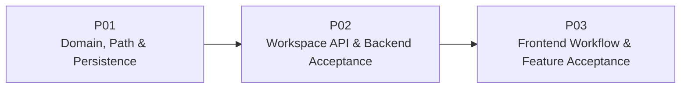

# M03 — Workspace System PLAN

> 本文把 [SPEC.md](./SPEC.md) 划分为三个顺序、可启动、可测试的集成 Plan。PLAN 保持阶段级粒度；具体 Module、Test Case、文件级实现步骤和 Wave 依赖由后续当前 Plan 的 TASK 再拆分。质量与验收直接进入每个 Plan 的 Exit Gate，不单独设置 Quality Plan。

## 1. Plan Status（计划状态）

| Field | Value |
|---|---|
| Milestone / Feature | `M03 — Workspace System` |
| Status | Ready for TASK decomposition |
| Feature Dependency | `M02 — Backend Foundation` |
| Plan Sequence | `M03-P01 → M03-P02 → M03-P03` |
| Requirements Source | [SPEC.md](./SPEC.md) |
| Architecture Source | [ARCHITECTURE.md](../../ARCHITECTURE.md) |

## 2. Delivery Strategy（交付策略）



三个 Plan 的累计交付关系：

1. **P01** 建立 Workspace Entity、Windows Path Resolver、具体 Repository、Version `2` Migration 和 Application Service，使 Workspace 业务边界在 Backend 内完整可测且服务仍能从 Version `1` 安全升级启动。
2. **P02** 把四个 Workspace Use Case 暴露为稳定 REST API，完成错误映射、CORS 演进和 Backend 累计验收，形成可由任意 Client 使用的真实 Workspace 系统。
3. **P03** 在现有 React Shell 中接入 Workspace Client 与交互流程，完成添加、列表、重命名、刷新、失效处理和重启后重开，并执行 M03 Feature Acceptance。

三段分别形成“可信业务内核”“可调用后端能力”“用户可操作闭环”。P03 只承接前端集成和累计验收，不承担 P01/P02 应完成的领域、路径、Migration 或 API 测试债务。

## 3. Plan Count Rationale（计划数量说明）

M03 使用三个 Plan，而不是机械拆成 Roadmap 示例中的约五个 Plan：

- Entity、Path Identity、Migration 和 Repository 共同构成一个不可分割的持久业务基础；拆开会产生没有真实不变量的占位层。
- Application Service 与 REST Route 的公开契约需要在持久基础稳定后一起集成，形成一个可独立调用的 Backend 增量。
- Frontend Client、状态与 UI 共享同一用户旅程，放在一个 Plan 内能完成端到端闭环，但后续 TASK 仍可按 API、Controller、Component、Integration 和 Gate 细分。
- 自动验证和人工验证进入对应 Plan Gate，不增加只做“测试”或“收尾”的第四个 Plan。

## 4. Global Constraints（全局约束）

- M03 只实现 [SPEC.md](./SPEC.md) 定义的 Local Workspace System，不引入 M04+ Entity、API、表、Runtime 或 Tool。
- 复用 M02 的 Python `>=3.11`、FastAPI、Pydantic、标准库 `sqlite3`、Application Factory、Database Boundary 和 Migration Runner。
- 不修改已发布的 Version `1` Migration；M03 仅追加连续 Version `2`。
- `WorkspaceRepository` 是具体业务 Port；不创建 ORM、Repository Base Class、Unit of Work 或未来 Repository 空壳。
- Route 不写 SQL、不直接访问文件系统；Application Service 不依赖 FastAPI；Infrastructure 类型不泄漏到公开 Contract。
- 路径必须在进入 Repository 前经过规范化、真实目标解析和状态检查；Database Unique Constraint 是重复路径的最终并发保护。
- `root_path` 创建后不可修改；Rename 只改变显示名称，Open 只在重新验证成功后更新时间。
- Frontend 只有 `src/api/` 可以直接调用 `fetch`；Component 不导入 Workspace API Client。
- Frontend 不使用 Browser Storage（浏览器存储）持久化当前 Workspace，不使用浏览器目录句柄或后端系统目录选择器。
- M01 Fixture 与 M02 Backend Connection 保持可用；M03 Workspace 不伪造 Conversation Ownership。
- 每个 Plan 都包含相关自动测试、启动/构建 Smoke Path（冒烟路径）、架构范围检查和 Git 范围检查。
- TASK 不得通过修改 PROJECT、ARCHITECTURE 或 ROADMAP 来扩大 M03 范围；若公共架构决策确需改变，应先回到 SPEC/Architecture 评审。

## 5. Intended Change Boundaries（预期改动边界）

```text
backend/src/mini_agent/
  domain/workspaces/                    # Entity、值约束、领域错误
  application/workspaces/               # Use Case 与 Repository/Path Port
  infrastructure/workspaces/            # Windows Path Resolver
  infrastructure/sqlite/
    workspace_repository.py             # SQLite Adapter
    migrations/
      registry.py                       # 追加 Version 2
      versions/v002_workspaces.py
  api/
    routes/workspaces.py
    schemas/workspaces.py
    app.py                              # Workspace Service 装配与 Route 注册

backend/tests/
  unit/                                 # Entity、路径与 Service 边界
  integration/                          # Migration、Repository、API、Lifespan

frontend/src/
  api/workspaces*                       # DTO Validation 与 Client
  app/workspaces*                       # 生命周期、状态和 App 组合
  components/workspaces/                # 表单、列表、状态、Rename UI
  components/shell/                     # Sidebar 接入
  test/                                 # Source Boundary 与累计回归
```

后续 TASK 可以调整目录或文件名，但必须保持以下 Seam（接缝）：

- Workspace Entity 不访问 SQLite、FastAPI、React 或文件系统。
- Application Service 接收可注入 `WorkspaceRepository`、`WorkspacePathResolver`、ID Generator 和 Clock。
- Path Resolver 返回类型化结果/错误和内部 Comparison Key（比较键），不返回裸 `OSError`。
- SQLite Adapter 复用既有 Database Connection/Transaction Context，不自行建立第二套连接策略。
- Route 使用类型化 Request/Response Schema 和集中 Domain Error Mapping（领域错误映射）。
- Frontend Client 校验 Response Payload；Controller 管理竞态；Component 只消费 View Model 与 Callback。
- 不创建 `conversations`、`sessions`、`runs`、`tools`、`memory` 或其他未来目录的空壳。

## 6. Requirement Traceability（需求追踪）

| Requirement | Primary Plan | Supporting / Final Plan | Required Evidence |
|---|---|---|---|
| `M03-R01` Workspace 领域不变量 | `M03-P01` | `M03-P02` | Entity/Service tests、API response |
| `M03-R02` Windows 路径规范化与身份 | `M03-P01` | `M03-P02` | Resolver matrix、duplicate API test |
| `M03-R03` 路径错误分类 | `M03-P01` | `M03-P02`、`M03-P03` | Resolver/error/UI tests |
| `M03-R04` Version `2` Migration | `M03-P01` | `M03-P02`、`M03-P03` | Upgrade/idempotence/schema evidence |
| `M03-R05` Repository、排序与事务 | `M03-P01` | `M03-P02` | Repository/API integration tests |
| `M03-R06` 四个 REST 用例与错误信封 | `M03-P02` | `M03-P03` | API contract tests、manual calls |
| `M03-R07` Open 重检和失效列表隔离 | `M03-P01`、`M03-P02` | `M03-P03` | Service/API/UI integration evidence |
| `M03-R08` Frontend API Boundary | `M03-P03` | — | Client/source boundary tests |
| `M03-R09` 完整 Workspace UI Workflow | `M03-P03` | — | Component/App tests、人工闭环 |
| `M03-R10` M01/M02 回归与无 M04+ | 每个 Plan | `M03-P03` | Regression、schema/source inspection |
| `M03-R11` 隐私、CORS 与安全错误 | `M03-P02` | `M03-P03` | CORS/error/log/UI checks |

## 7. M03-P01 — Domain, Path & Persistence

### 7.1 Goal

交付可独立测试的 Workspace 业务内核：固定 Entity 和错误类型，可靠识别 Windows 项目目录身份，通过 Version `2` Migration 与具体 SQLite Repository 持久化，并以 Application Service 编排四个用例，为 P02 暴露 HTTP Contract 做好稳定基础。

### 7.2 Depends On

`M02 — Backend Foundation` Feature Acceptance 已通过；现有 Production Schema Version 为 `1`。

### 7.3 Scope

- 定义 Workspace Entity、Availability、名称规则、时间不变量和类型化 Domain Error。
- 定义最小 `WorkspaceRepository`、`WorkspacePathResolver`、ID Generator 和 Clock Port。
- 实现 Windows Drive-rooted Path 的语法拒绝、规范化、真实目标解析、目录/可访问性检查和 Case-insensitive Key（大小写不敏感比较键）。
- 覆盖大小写、分隔符、Dot Segment（点路径段）、Junction/Symlink Alias（目录联接/符号链接别名）、Volume Root、UNC/Device Path、Missing、File 和 Permission Error。
- 增加 `002_workspaces` Migration，并以追加方式更新 Production Registry。
- 实现具体 SQLite Workspace Repository、Row Mapping、唯一约束冲突、稳定排序、Rename 和 Touch Opened。
- 实现 Create/List/Rename/Open Application Service；Open 失败不更新时间，List 单项失效不影响其他记录。
- 在测试中注入固定 Clock/ID 和 Fake Path/Repository，分离领域、文件系统与 SQLite 证据。
- 保持 FastAPI App 从空库和 Version `1` 数据库启动后可 Ready；P01 不新增公开 Workspace Route。

### 7.4 Outputs

- Workspace 领域对象只包含已验证的稳定元数据，Root 创建后不可修改。
- 路径别名映射到相同 `root_path_key`，Database Unique Constraint 阻止重复持久化。
- 新数据库和 M02 数据库均可迁移到 Version `2`；重复启动不修改历史 Migration。
- `workspaces` 是唯一新增业务表，Schema 不包含 M04+ 能力。
- Repository 可以创建、查询、列表、重命名和更新时间，并准确报告 Not Found/Duplicate/Persistence Error。
- Application Service 的四个用例无需 FastAPI 即可完整测试。
- M02 `/api/health` 在启动后报告 Schema Version `2`，其他 Contract 不变。

### 7.5 Automated Verification

- Entity 默认名称、合法/非法名称、不可变字段和时间关系测试。
- Path Resolver 的合法绝对目录、大小写/分隔符/Dot Segment、别名去重测试。
- Relative、Volume Root、UNC、Device/Extended Path 和非法语法拒绝测试。
- Missing、Not Directory、Inaccessible 的分类测试；测试不得依赖开发者真实权限配置，可用 Fake OS Boundary 或隔离 Fixture。
- Version `1 → 2` Upgrade、空库启动、重复执行、Checksum/History 不变和 Schema Inspection（模式检查）测试。
- Repository Create/List/Get/Rename/Touch、稳定排序、Duplicate、Not Found、Row Mapping 与 Transaction tests。
- Service Create/List/Rename/Open、默认名称、单项失效隔离和 Open Failure 不更新时间测试。
- Backend 全量 pytest，确认 M02 Migration/Health Regression 继续通过。

建议 Plan Gate 命令形态（具体 Test Selector 由 TASK 根据实现固定）：

```powershell
cd backend
python -m pytest
python -m mini_agent
```

### 7.6 Human Verification

1. 使用一份已完成 M02 Version `1` 的临时 Data Directory 启动 Backend，确认自动升级到 Version `2`。
2. 停止并使用同一目录再次启动，确认 `schema_versions` 只有 Version `1` 和 `2` 各一条记录。
3. 检查 SQLite Schema，确认只新增 `workspaces`，且 `root_path_key` 具有唯一约束。
4. 检查 `/api/health` 仍使用 M02 Schema，并返回 `schema_version: 2`。
5. 检查 Git 状态，确认数据库、WAL/SHM、Cache 和临时目录未暂存。

### 7.7 Exit Gate

- `M03-R01` 至 `M03-R05` 的 Backend 内部契约具有完整自动证据。
- Path Resolver 不接受 SPEC 禁止的路径形式，并能稳定区分四种 Availability。
- Create/List/Rename/Open Application Service 在 Fake 与真实 SQLite Adapter 上均通过测试。
- Version `2` Upgrade、重复启动、唯一约束和事务测试通过；Version `1` 文件未修改。
- Backend 全量 pytest 返回退出码 `0`，服务可启动、Health Ready 且 Version 为 `2`。
- Schema 和 Source Inspection 确认没有公开 Workspace Route 或 M04+ 能力。
- P01 Gate 通过后才展开 P02 TASK。

## 8. M03-P02 — Workspace API & Backend Acceptance

### 8.1 Goal

将 P01 的 Workspace Application Service 接入 FastAPI，交付可由前端或命令行稳定调用的 Create、List、Rename 和 Open API，并完成 Error Envelope、CORS、依赖装配、隐私和 Backend 累计验收。

### 8.2 Depends On

`M03-P01` Exit Gate 已通过；P01 的 Entity、Service、Repository、Path Resolver 和 Version `2` Contract 不在本 Plan 重写。

### 8.3 Scope

- 定义严格的 Create/Rename Request、Workspace/List Response 和 Availability Schema。
- 实现 `GET /api/workspaces`、`POST /api/workspaces`、`PATCH /api/workspaces/{id}` 和 `POST /api/workspaces/{id}/open`。
- 将 Domain Error 映射到 SPEC 规定的 HTTP Status、Code、Message 和 Field。
- Duplicate Error 可以安全携带已有 Workspace ID，帮助 Client 引导重新打开。
- App Factory/Lifespan 装配具体 Repository、Path Resolver、ID 和 Clock，并向 Route 注入 Application Service。
- 测试可替换 Workspace Service，不访问真实用户目录或默认 Data Directory。
- CORS Allow Methods 扩展为 `GET`、`POST`、`PATCH`、`OPTIONS`，并为 JSON Command 允许 `Content-Type` Request Header；Origin Allowlist 和无 Credentials 规则不变。
- 验证未知字段拒绝、Malformed Request 边界、Content Type、未知 ID 和未知 Route。
- 验证响应/日志不包含 `root_path_key`、SQL、Database Path、Traceback 或原始 OS Error。
- 执行真实临时目录与 SQLite 的 API Integration Test（API 集成测试）和 Backend 累计回归。

### 8.4 Outputs

- Client 可以通过四个 Endpoint 完成 Workspace 的全部 M03 Backend 用例。
- Create 返回 `201` 和 `available` Workspace；List 返回稳定 Envelope 和排序。
- Rename 不接收 Root Path，Open 每次重新检查 Root 并只在成功后更新时间。
- 一个失效 Workspace 不会阻止 List 返回其他项目；其状态投影为准确 Availability。
- Duplicate、Invalid、Missing、Not Directory、Inaccessible、Not Found 和 Persistence Failure 均有稳定安全响应。
- M02 Health、CORS Allowlist、Startup 和 Migration Contract 继续通过。
- P03 可以只依赖公开 API，不需要了解 Domain/SQLite/OS 类型。

### 8.5 Automated Verification

- Create 的默认/自定义名称、`201`、Response Schema、Unknown Field 和非法输入测试。
- List Empty/Multiple/Stable Order、单项 Missing/Not Directory/Inaccessible 和 Item Isolation 测试。
- Rename Success/Invalid/Not Found、Root Immutable 和 Timestamp 更新测试。
- Open Success/Not Found/失效路径、时间更新和失败无更新测试。
- Duplicate Alias 的 `409 workspace_already_exists` 和并发 Unique Constraint 映射测试。
- Domain Error 到 HTTP Code/Status/Field 的 Parameterized Contract Test（参数化契约测试）。
- CORS 对允许 Origin 的 GET/POST/PATCH Preflight、`Content-Type` Header 和拒绝 Origin/Method/Header 测试。
- Lifespan Dependency Wiring（依赖装配）、Fake Service Override 和真实 SQLite/Temp Directory API 测试。
- Payload/Log/Exception 安全检查，以及未知 `/api/*` 仍为标准 `404` 的回归测试。
- Backend 全量 pytest 返回退出码 `0`。

### 8.6 Human Verification

1. 启动 Backend，通过 API 添加当前仓库绝对路径，确认返回 `201` 和规范化 Root。
2. 使用大小写、分隔符或 Dot Segment 形式再次添加同一目录，确认返回 `409` 而非创建重复记录。
3. 列表、重命名并重新打开该 Workspace，确认排序与时间变化符合契约。
4. 临时重命名一个专用测试目录后刷新列表，确认其为 `missing`；Open 返回安全错误且时间不变。
5. 恢复测试目录后再次 Open，确认恢复 `available`；不得移动或改名用户仓库本身。
6. 检查浏览器/命令行响应和 Backend 日志，确认没有内部比较键、SQL、数据库路径或堆栈。

### 8.7 Exit Gate

- `M03-R06`、`M03-R07`、`M03-R11` 的 Backend 部分具有完整自动证据。
- 四个 Endpoint、Request/Response 和 Domain Error Mapping 与 SPEC 一致。
- CORS 支持 Workspace UI 必需方法，但未放宽 Origin 或 Credentials 策略。
- 真实临时目录 + SQLite 的 Create/List/Rename/Open 集成闭环通过。
- Backend 全量 pytest 返回退出码 `0`，服务从 Version `1`/空库启动均可 Ready。
- API/Schema/Source Inspection 确认没有 Delete、Path Update、Directory Browser、File Tool 或 M04+ Route。
- P02 Gate 通过后才展开 P03 TASK。

## 9. M03-P03 — Frontend Workflow & Feature Acceptance

### 9.1 Goal

让现有 React UI 通过独立 Workspace API Boundary 使用 P02 的真实 Backend 能力，在 Sidebar 完成列表、添加、重命名、刷新、路径失效处理和重启后重新打开，并完成 M01–M03 累计回归与 M03 Feature Acceptance。

### 9.2 Depends On

`M03-P02` Exit Gate 已通过；P02 的 REST Contract 是前端唯一 Backend 事实源。

### 9.3 Scope

- 实现 Workspace DTO Runtime Validation（运行时校验）、API Client 和类型化 Client Error。
- Client 覆盖 List/Create/Rename/Open 的成功、HTTP Error、Network Error、Abort 和 Invalid Payload。
- 实现 Workspace Collection/Operation State、订阅或 Hook Boundary（Hook 边界）、请求取消和过期响应保护。
- Backend Connection 进入 Connected 后加载一次；提供显式 Refresh，Retry 恢复后重新加载。
- 在 Sidebar “项目”区域接入真实 Workspace 列表、当前项、Availability、添加和重命名入口。
- 添加表单接受绝对路径和可选名称，明确说明“输入或粘贴路径”；不提供伪目录选择按钮。
- 实现 Loading、Empty、Collection Error、Operation Error、Available、Missing、Not Directory 和 Inaccessible UI。
- Create/Open/Rename 的成功结果更新本地投影；失败保留最近成功列表和当前选择。
- Sidebar 折叠态、Dialog/Inline Form Focus、键盘操作、Accessible Name、非纯颜色状态和长路径溢出处理。
- 保持 M01 Fixture/UiIntent 和 M02 Backend Connection；演进 Source Boundary 以允许 App Workspace 层依赖 `api/`，但纯展示 Component 仍不直接依赖 Client。
- 完成 Backend pytest、Frontend Vitest、Frontend Build 和重启后重开人工验收。

### 9.4 Outputs

- Backend 可用时 UI 加载持久 Workspace；无记录时展示清晰 Empty State（空状态）。
- 用户可以输入当前仓库绝对路径并创建 Workspace；成功后成为当前项。
- 用户可以修改显示名称，磁盘目录与 Root Path 保持不变。
- 页面/服务重启后列表仍存在，用户可以显式重新打开并看到当前状态。
- 失效项不会让列表消失，具有准确文本状态和可重试的“重新检查并打开”路径。
- Slow/Old Request（慢/旧请求）不能覆盖新操作；重复提交受控，Unmount 后不提交状态。
- 长名称/路径、Sidebar 两态、键盘 Focus 和错误提示可访问且不破坏布局。
- M01 的 Agent 状态 Fixture 与 M02 的 Connection Retry 继续可演示。

### 9.5 Automated Verification

- Workspace Client 的 URL/Method/Body/Header、成功 DTO、Domain Error、非 JSON、错误 Shape、Network、Abort 测试。
- Collection 初始 Idle/Loading、Connected 后加载、Empty/Ready/Error、Refresh 和 Connection Retry 测试。
- Create、Rename、Open 的 Pending/Success/Error、Duplicate、状态保留和列表重排测试。
- 两个重叠请求、快速重复点击、Abort 和 Unmount 的竞态保护测试。
- Add Form 的 Label、Path Help、可选 Name、Validation、Submit/Cancel 和 Focus 测试。
- Workspace List 的 Current、Availability 文本、失效重检、Rename、长内容溢出和非纯颜色语义测试。
- Sidebar 展开/折叠两态、Accessible Name/Tooltip、Backend Connection Footer 和 Workspace 区域集成测试。
- Source Boundary 确认 `fetch` 只在 `src/api/`，Component 不导入 API Client，Fixture/Presentation 不依赖 Workspace DTO。
- M01/M02 全量 Frontend Regression、Backend pytest 和 Frontend Production Build。

建议最终自动验证命令形态：

```powershell
cd backend
python -m pytest

cd ..\frontend
npm run test -- --run
npm run build
```

### 9.6 Final Human Acceptance（最终人工验收）

1. 准备全新临时 Data Directory，启动 Backend 与 Frontend，确认 Health Ready 且 Schema Version 为 `2`。
2. 在 Workspace Empty State 中输入当前仓库的绝对 Windows 路径，省略名称创建，确认名称默认取目录末段并成为当前项。
3. 使用同一路径的大小写、斜杠或 Dot Segment 变体再次添加，确认 UI 显示重复错误且没有第二条记录。
4. 将 Workspace 显示名称改为一个不同名称，确认列表更新而磁盘目录未改变。
5. 刷新页面，确认列表仍在但不自动选择；点击 Open 后成为当前项。
6. 重启 Backend 和 Frontend，再次从列表打开，确认持久化和 `last_opened_at` 排序工作。
7. 创建一个专用临时目录并添加；关闭应用后移动该测试目录，再启动并刷新，确认显示 Missing 且重新打开失败，不对用户仓库执行此操作。
8. 恢复临时目录并使用“重新检查并打开”，确认状态恢复 Available。
9. 在 Sidebar 展开/折叠、键盘操作和窄/宽视口下检查添加、当前项、状态、Rename Focus 和长路径溢出。
10. 抽查 M01 六个 Fixture、四类 UiIntent、Composer 演示和 M02 Backend Disconnected/Retry，确认累计功能无回归。
11. 检查 SQLite Schema 和 `git status --short`，确认只有 Version `2`/`workspaces` 属于 M03，运行时数据库、WAL/SHM、Cache、`dist/` 和 `node_modules/` 未暂存。

### 9.7 Exit Gate / M03 Feature Acceptance

- P01、P02、P03 的全部自动测试与人工检查通过。
- `M03-R01` 至 `M03-R11` 没有证据缺口。
- Backend pytest、Frontend Vitest 和 Frontend Build 的最新完整运行返回退出码 `0`。
- 用户能够添加、列表、重命名、刷新和重新打开真实 Local Workspace。
- 空库与 Version `1` 数据库均安全迁移到 Version `2`，重复启动保持幂等。
- Duplicate Path Alias、Missing、Not Directory 和 Inaccessible 路径均有准确、安全、可恢复的行为。
- 重启后 Workspace 元数据仍存在；应用不自动恢复持久 Active Workspace。
- M01 Fixture/UiIntent/主要布局与 M02 Health/Connection 没有语义回归。
- Git 范围、隐私、CORS 和 Architecture Inspection 通过，无 Directory Browser、Path Update、Delete、File Tool 或 M04+ 能力。
- 人工验收通过后，M03 才可以标记完成并进入 M04。

## 10. TASK Handoff Rules（TASK 交接规则）

后续生成 `TASK.md` 时：

- 一次只展开当前 Plan，按 `M03-P01 → M03-P02 → M03-P03` 顺序推进。
- 每个 Plan 建议约 4–6 个边界清晰的 Task，数量以独立验证、公共 Contract 顺序和避免写冲突为准，不机械凑数。
- TASK 只拆 Module/File Output（模块/文件输出）、测试、集成和依赖，不再增加新的 Plan 层级。
- 使用 ROADMAP 规定字段：

```text
task_id
goal
depends_on
write_scope
expected_output
verification
wave
status
```

- P01 公共 Contract 优先：Entity/Error/Port 先于 Path Adapter、Migration/Repository 和 Service Integration。
- P02 Schema/Error Mapping 先于 Route/App Wiring；真实 SQLite API Integration 在公共响应稳定后执行。
- P03 API DTO/Client 先于 Controller，Controller 先于交互 Component/App Integration。
- 同一 Wave 的 Task 避免修改同一 Migration Registry、App Factory、Sidebar 或公共 Export File。
- Windows 权限、Junction 和异常路径优先使用隔离 Fixture/Fake OS Boundary；自动测试不得依赖开发者机器的固定目录或管理员权限。
- 每个 Task 使用临时 Data Directory、Fake/Stub/Mock Fetch，保持测试离线、确定且不污染仓库。
- 每个 Plan 的最后一个 Task 执行该 Plan 全量测试、启动/构建 Smoke、Git 范围检查和 Exit Gate，不把验证集中推迟到 P03。
- TASK 不得把浏览器存储、系统目录选择器、Workspace 删除/改路径、Git 探测、Conversation、Tool 或通用 Framework 偷渡进 M03。
- P03 Gate 通过后直接进入 M03 Feature Acceptance，不增加 P04 或独立 Quality Plan。
